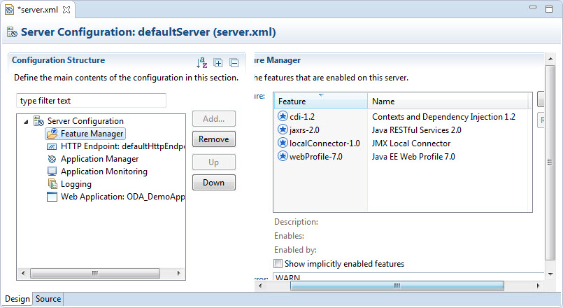

# IBM Websphere Liberty

IBM Websphere Liberty is a widely-used modern lightweight server (less than 70Mb, I have several running on my PC) that allows modern Java EE development with Java 8. The server is free for development and build server, with limited production use (up to 2Gb of JVM heap space across all instances for the organisation). Web applications are deployed as standard web archives, which means it's easy to download and install demos of various frameworks and easy to use Maven. This is something I've fought with when developing OSGi plugins, because Maven is designed to manage and install dependencies be compilation. On the other hand OSGi best practice is to pull them from other plugins, defined in the MANIFEST.MF. At the very least OSGi needs the plugins adding to the classpath in the MANIFEST.MF. Tycho is designed to bridge the gap between what Maven expects and what OSGi expects, but it's not great. So a standard web application, sucking any jar files in via Maven, makes life a lot easier.

<!-- more -->

Setup and installation of your Websphere server(s) is easy, particularly so if you use Eclipse. My preference is to use a separate Eclipse instance and workspace for each Liberty server. This means installing all relevant plugins in separate Eclipse instances, but the Eclipse Marketplace makes this easier. In the Eclipse Marketplace is "IBM Websphere Application Server Liberty Developer Tools for Neon" (Neon was released on June 24th 2016, the Liberty tooling already had 1,568 downloads before the end of that month and, to date, has 28.8k downloads). Once installed, it's easy to create and manage a Liberty server from Eclipse, by right-clicking in the Servers view and selecting New > Server. I documented this further on [OpenNTF's CrossWorlds wiki](https://wiki.openntf.org/display/CW/Installing+and+Configuring+Websphere+Liberty+Server).

One of the advantages of the server is that features can be deployed to give server-wide functionality. An example of this is [CrossWorlds](https://openntf.org/main.nsf/project.xsp?r=project/Crossworlds), an application listener and servlet filter to configure and manage Domino thread setup and OpenNTF Domino API factory setup for any configured applications. It means code can be run when the application is initialised and destroyed. An example of where this functionality might be useful is for managing thread pools for access to an underlying database, as seems to be best practice for e.g. OrientDb. Plus it only needs to be installed once on the server, not in each application. Admittedly Maven makes management of duplicate code easier, because it just needs updating in the central Maven repository and can be pulled down into each application. (If a specific version number is defined in the Maven configuration of the application, only that version will be used, but alternatively the latest version will be pulled down.)

The server can be configured via XML and other files, or editors from the Eclipse plugin. The main ones are:

- **bootstrap.properties** which holds variables to be loaded at runtime.
- **server.env** which holds environment variables for the server to use.
- **server.xml** which holds the main server configuration. A screenshot is shown below.

I've not gone beyond basic configuration so far. But changing the post the server uses is very straightforward, just defined in the HTTP Endpoint feature. I also set up HTTPS for one server following instructions on a blog post, which was also easy. But I know a real-world deployment would require a lot of additional configuration and questions answering, possible pitfalls and probably optimisation.

However, initial setup is very easy, easy enough to complete in just a few minutes and let me focus on doing the development I want. So much so that when developing applications that will subsequently be wrapped up into OSGi plugins for Domino, my preference by far was using Liberty. One of the reasons for that is that, once an application is added to the server, when it's built with any additional changes, it is automatically stopped and restarted with the changes available within seconds. That is very useful. If those few seconds get frustrating, [JRebel](https://zeroturnaround.com/software/jrebel/) is the obvious choice.

At this point, while I'm focussing on other parts of a stack and predominantly doing development work only, Liberty is useful to stay with. Apache Tomcat is an obvious other server to consider and experiment with, when there is time and need. One area I've not found a quick answer to is how to deploy the kind of server-wide feature extensions used by CrossWorlds. It may be a case of deploying that code within each application itself, I don't know. If that is required, it's probably not a showstopper and certainly not something I have to worry about now.