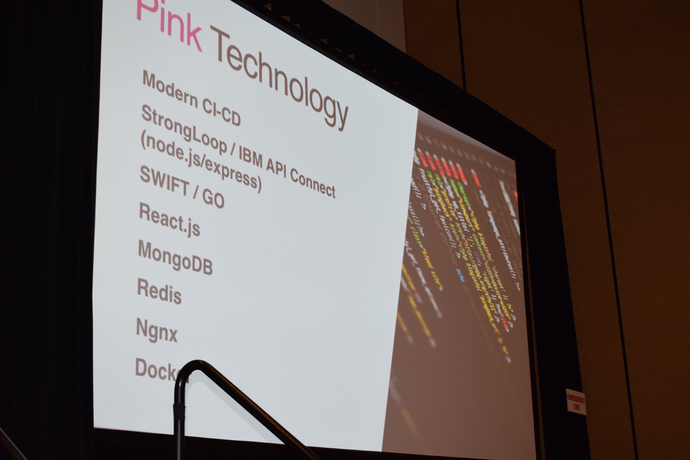
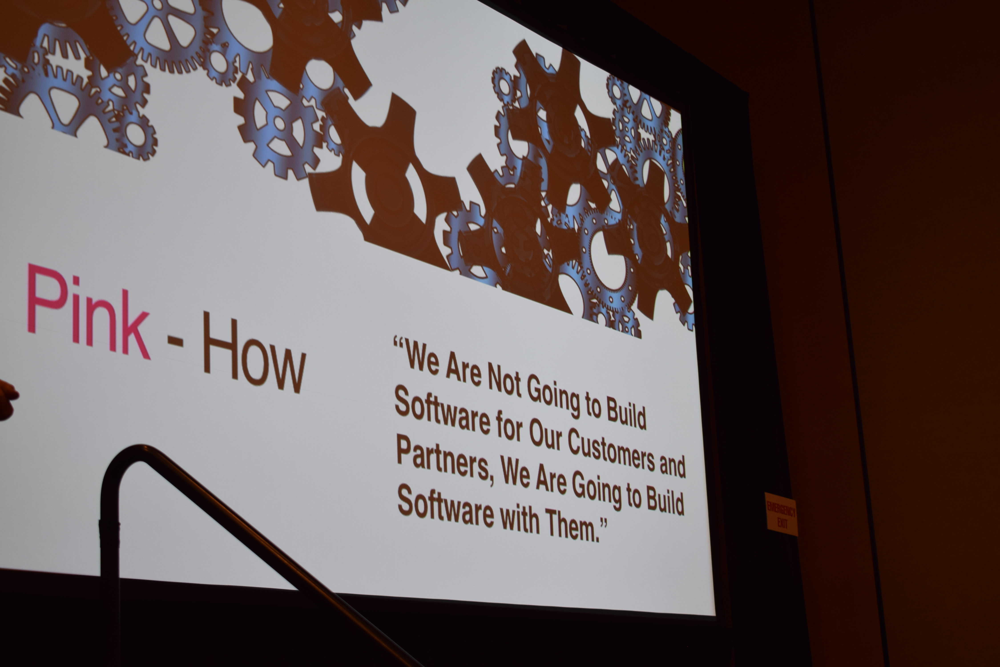

# IBM Connect 2017: Embrace Fear

## This Is Not a Vendor Pitch

When I began my personal blog last year, I was investigating new technologies beyond the IBM Collaboration Solutions stack. This last week I've been attending and presenting at the conference, including covering one of those new technologies. The experience for me has changed drastically the direction I was heading. But this is not about a vendor's products, this is about the open source technologies I intend to pursue over the next year.

<!-- more -->

Firstly, much of my direction over the last year has been Java. I like Java, the way it's strongly-typed, the way editors pull in what you need, particularly using something like Maven to do dependency management. And my brain is only so big. So keeping Java, JavaScript frameworks and all the proprietary technologies concerned me. But what concerned me most was that with current experiences, I couldn't see a way to regularly be working with JavaScript frameworks in my day-to-day work. And my personal time is personal, I've spent a lot of time evangelising to a certain audience and as a board member developing infrastructure and process management for [OpenNTF](https://www.openntf.org). So with the speed of change in JavaScript frameworks, working with them for a couple of months, learning things, then not touching them for six or nine months during which the landscape shifted again, that was just pointless and depressing. So the key has always been technologies that works for business, that work for me, that work for OpenNTF, that work with other frameworks that I see having benefit like [Darwino](https://www.darwino.com), and that give me scope to continue evangelising.

## Turning an Issue Into A Feature

Or "It's Okay to Fail". Monday was spent taking part in a hackathon. The planned outcome we were to have was a whereabouts app - not granular access into calendars, but what are people I'm interested in doing today, tomorrow etc. "Office", "Working from Home", "Customer A", "Office am, Holiday pm", that kind of thing. Then with microservice functionality around it. Integration with [IFTTT](https://ifttt.com/) to _know_ you were in the office _now_ because your mobile device connected to a certain wifi, to _know_ you were no longer in the office _now_ because your mobile device disconnected from a certain wifi. Also microservice functionality to integrate with [Watson Workspace](https://workspace.ibm.com/) where you could ask where someone was. It was going to be API driven, REST services whose core methods could also be called directly from Java by the (Java-based) UI controllers. The idea generated a lot of interest from the IBMers visiting.

We failed. Miserably! We struggled to even get the basics of the app working, when I had expected to have that part done by lunchtime.

## GraphQL

The desire to integrate with Watson Workspace and the confidence about how easy that part would be, that all came from experience since October of the Watson Work APIs. Technology-wise, the interest for me came in [GraphQL](http://graphql.org/). Within half an hour of reading the documentation I was sold on the developer benefits of not only consuming it but also providing it. So when I was looking for a topic for an abstract for IBM Connect, GraphQL was a no-brainer and pretty much a certainty in my mind to be accepted. I expect to be delivering sessions on it for quite a bit this year, because it's still so new and it's power is unknown for the attendees of many of the conferences I speak at.

What was also key for my week was the start of that hackathon, when I was nursing a hangover, still feeling queasy. Jason Roy Gary gave the introductory speech, talking about Connections Pink, and he mentioned it would include GraphQL access. My interest was piqued.

## The Turning Point: Pink Wednesday

It takes a confident man to wear a pink suit. It takes someone very special to pull it off.

I had spoken to Jason Roy Gary again the night before, had heard about his apparel for the session, and had been encouraged to attend. When I sat the following morning, I had two other sessions on my schedule at the same time, one that was very pertinent to the technologies I was currently working with. What made my mind up was seeing a slide deck that was not significantly different to what had previously been presented. I even passed on a technical session on Connections Pink to go to the more high-level introductory session by Jason Roy Gary and Baan Slaven.

I was already aware that Connections Pink was aimed at allowing developers to extend it, and as a developer who has struggled with developing against its predecessor, that interested me. What _really_ interested was this slide:

Yes, I had sat in the session for the speaker not the screen, so it's not at the best angle. But this is the first time I remember IBM Collaboration Solutions explicitly stating the stack they had chosen. Knowing that Darwino really needed a JavaScript framework to develop with, that Connections Pink would give me a framework, this interested me as tools and technologies I could get regular experience with, my main priority.

It scares the hell out of me, because there are technologies that are just words. But I have a community. Those in that community have a community, and one that is renowned beyond the community for being helpful not judgemental. We can be scared together. We can fail. We can learn. And we can adapt.

What was also extremely interesting was this slide:

This is an amazingly refreshing attitude and one which, as a developer, excites me. I've been involved in developing _with_ IBM occasionally. I wrote XPages Extension Library book for IBM Press with an IBMer. I contributed code back to the Extension Library via pull requests. At a time when resources are being squeezed more and more, it's the only approach that makes sense.

And if you're looking to work on a project that includes new technologies, and you're looking to document that, it's the "how" and documenting that journey which is most important, not _what_ you build. The "how" was important to me when I took two weeks off work to change from building XPages with Server-Side JavaScript some years ago to build a small Help application with XPages and Java. I produced and shared the "what", but not the "how". As an evangelist now, I realising sharing the "how" is the key thing I need to do over the next year.

## The New Stack

What does my new stack look like? I'll tell you when I know what works _for me_, could appeal to _my customers_ and could appeal _to other developers_. As an evangelist and an employed developer, I'm very mindful of others.

But IBM Domino will be a key part of that. It's a strong data store with a long heritage, with community work that makes it even more innovative, and more will come around that. Those who think it's old and clunky don't fully understand it's power.

So I'm glad that as well as developing a [Watson Work Services Java SDK](https://wiki.openntf.org/display/WWSJava/Watson+Work+Services+API+Java+SDK) I also developed a [starter REST servlet](https://wiki.openntf.org/display/ODA/ODA+Demo+Servlet) for Domino using OpenNTF Domino API, both focussed on strong documentation. (I know the rest of OpenNTF Domino API is not as strongly documented, just this area, for now.)

Documentation will be key for the next year. So I want people to look at the documentation and feed back where it's not clear, needs improvement, or just could be improved. I want those to be templates that allow me and others to smooth a scary path for ourselves and others over the coming months, where we are willing (as Jason Roy Gary's anecdote proved) to [taste the pufferfish](https://en.wikipedia.org/wiki/Tetraodontidae#Poisoning), to take risks, and reap the benefits.