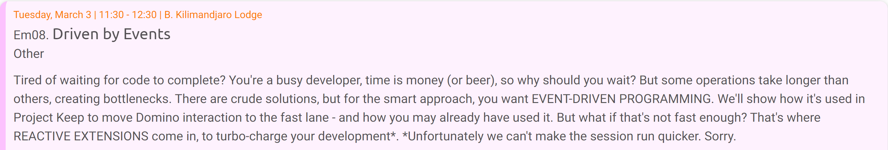
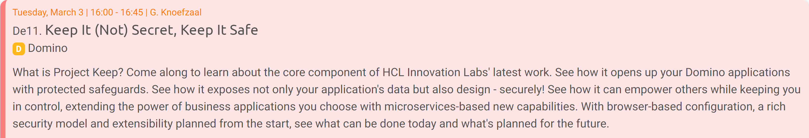
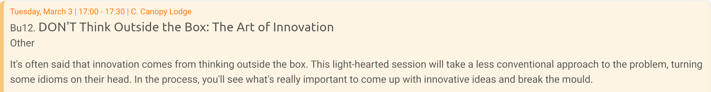

# Speaking at Engage 2020

It's just over six weeks until the first user group conference of the year, the always excellent Engage. And I will be speaking again this year, with three sessions.

<!-- more -->

The first session on Tuesday at 11:30 in Kilimandjaro Lodge, with Stephan Wissel, will introduce Domino developers to event-driven programming and highlight how and why it's used in Project Keep.

The second session on Tuesday at 16:00 in Knoefzaal, also with Stephan Wissel, will give more background on Project Keep and what it will offer for Domino developers and administrators.

The third session on Tuesday at 17:00 in Conopy Lodge will take an innovative approach to analysing problems and identifying solutions. I'll take the scenic route but introduce you to the key to innovation.

It will also be my first conference as a member of HCL Labs. It's been a busy couple of months with lots achieved and still more to do. Engage has always been a key event in Europe for the HCL products. Without doubt it will be a key milestone for us and other members of the team also have sessions.

I will also be representing OpenNTF as well alongside other members of the team. We have our usual round table on Wednesday at 16:00 and we look forward to hearing from you.