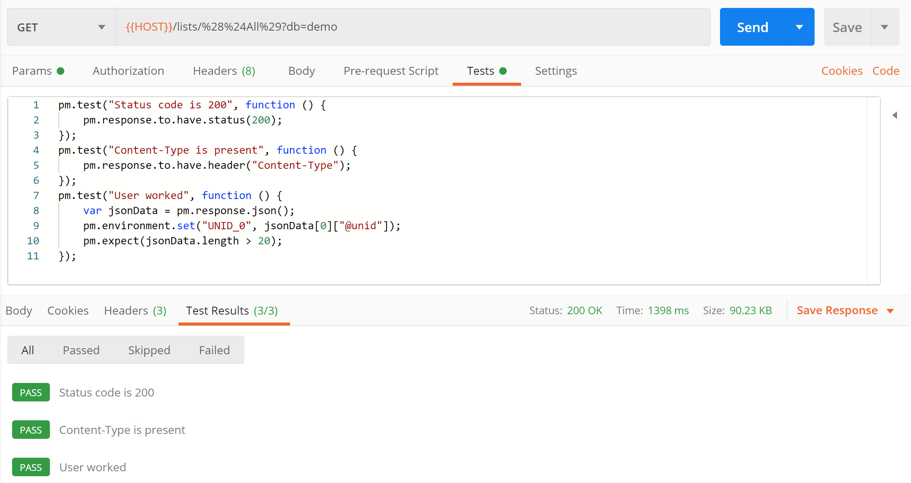
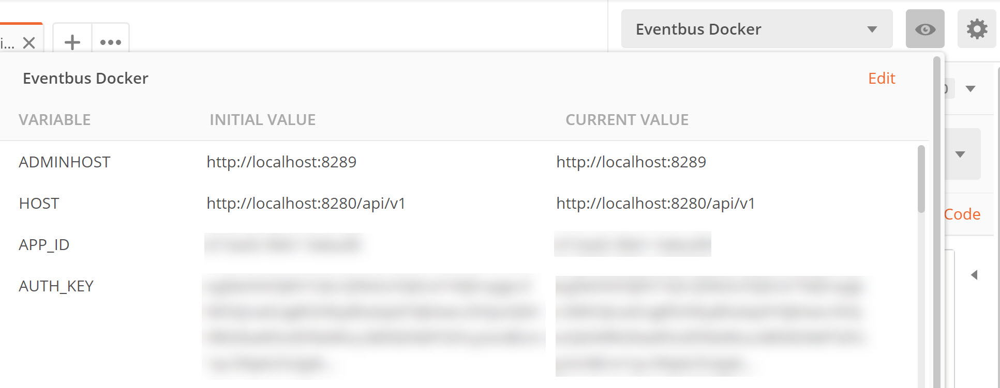

# Getting the Most out of Postman

## Postman Tests

If you're developing an API, the best tool to test with is Postman. When I initially used Postman, I only used it for basic individual tests. If you followed my blog at Intec, that also led me to recommend and to use Node-RED for creating a test flow. However, over the last few months I've learned about significantly more functionality of Postman, which starts to become extremely relevant when using Postman collections for other purposes.

<!-- more -->

## Collections

Creating **collections** of requests is standard, but being able to group requests in **folders** is useful. If you're developing an API, you should be building from an OpenAPI specification. And if your OpenAPI spec has a number of requests, they will have tags to group them. A useful way to order your collections is to builds folders that correspond to the tags in the OpenAPI spec.

Having a collection on one device is good. But Postman also syncs your collections onto all devices. This is because your collections are shared to a personal **workspace**. You can also create team workspaces, but the free option is limited to 25 requests. If your API has a reasonable number of endpoints, the free team workspace probably won't be enough.

But a workspace can also be exported. The export is a JSON file, which then allows it to be stored in your source control repository, as a single version of the truth. I've not come across any functionality to automatically sync to a Git repo, which means that your team must be disciplined, ensuring that they do not corrupt the collection. This is easy to do, if you change a request for a specific path or query parameter. But there are ways round that.

## Variables

Variables allow you to parametrise requests and are key-value pairs. You can recognise them in a collection by the curly braces. The variables can be in a URI, in header parameters or in the body of a request. For example `{{HOST}}/document/{{UNID_0}}/default?db=demo`.

This request URI has two variables:

- **HOST** which is the first part of the URI.
- **UNID_0** which is a document UNID.

The main kinds of variables you will typically use are:

- **Global** - used for all collections and requests.
- **Collection** - used for the current collection only.
- **Environment** - corresponding to a Postman environment.
- **Data** - corresponding to a file passed in.

With this you can have a much more effective set of requests, for example:

1. A GET request retrieving a collection of documents, for which you store the first document's ID as `{{UNID_0}}`.
2. A GET request against a single document, using `{{UNID_0}}`.
3. A PUT request to update that single document `{{UNID_0}}`.
4. A DELETE request to remove that document.

By using variables, you don't have to regularly change the request and you can have a collection that is run to test for regression bugs.

## Tests

But the question that remains is how to store those variables. That can be done in **Tests**. The main purpose of tests is to perform assertion checks against the response of a given request. But as part of that post-processing, you can also parse the response and store them to variables. Consider the following test script:

~~~javascript
pm.test("Status code is 200", function () {
    pm.response.to.have.status(200);
});
pm.test("Content-Type is present", function () {
    pm.response.to.have.header("Content-Type");
});
pm.test("User worked", function () {
    var jsonData = pm.response.json();
    pm.environment.set("UNID_0", jsonData[0]["@unid"]);
    pm.expect(jsonData.length == 10);
});
~~~

You can find more details about how to write postman tests in their [documentation](https://learning.postman.com/docs/postman/scripts/test-scripts/). But it's fairly straightforward. It doesn't take a great deal of learning to realise that this has three tests:

- That the response code is 200.
- That there is a Content-Type header.
- That the JSON response contains 10 results.

But most useful is the middle line of the last test. This sets an "environment" variable with the `@unid` property of the first JSON object returned. `pm.collectionVariables.set()` will set a variable for a collection, `pm.globals.set()` will set a global variable.

The tests then show up in the response are, to easily see whether tests passed or failed, as you can see from the image below. Of course tests are also useful when running a whole collection, as we'll see later.

## Environments

Environment variables are used for **environments**. Environments are particularly useful when testing a collection against different servers or running the same tests for development, testing, staging and production environments. This means you can have different base URLs, different app IDs and app secrets, different database paths etc. By switching environment, you can run the same collection's requests without changes.

The environments are available in the top right of Postman, where you:

- See the current environment and switch between the environments using the drop-down lists.
- View the current settings using the "eye" button.
- Manage the environments using the "cog" button.

This covers maximising the usage of Postman for running individual tests. But once you have a collection, there are other things you can do with the Postman collection that give you greater benefits.