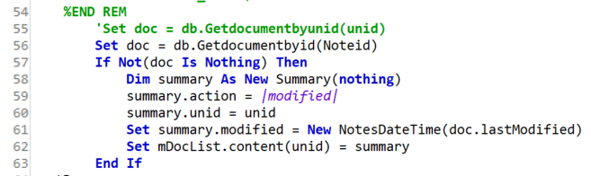
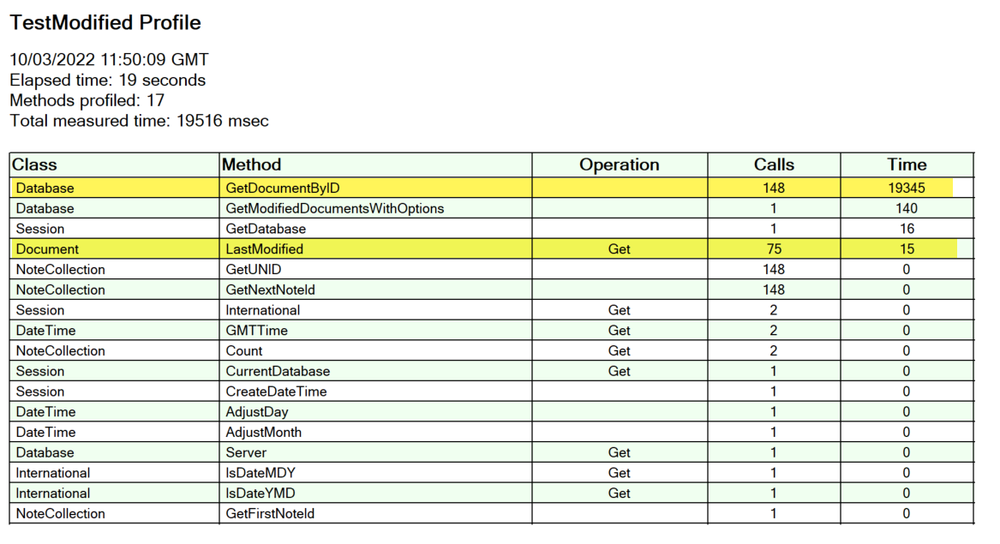
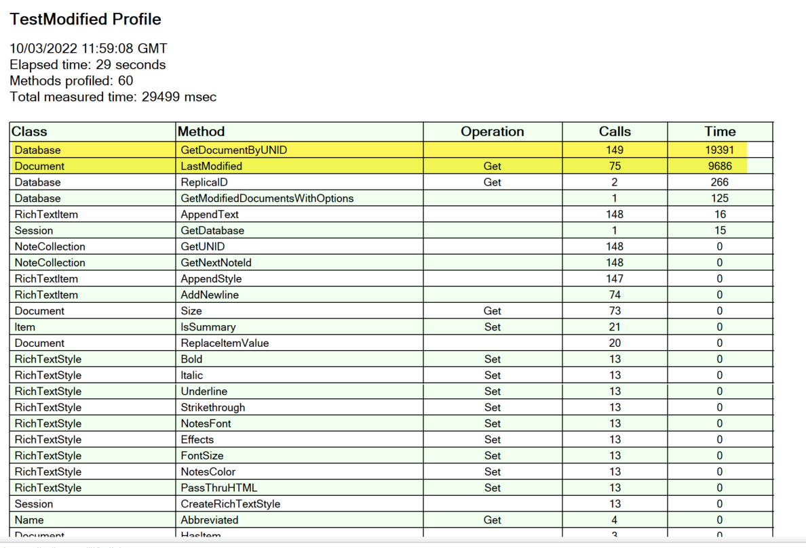

# LotusScript Profiling

LotusScript agent profiling is not new, but there are still some developers who are not aware of it. It's something I blogged about [more than ten years ago](https://www.intec.co.uk/why-you-shouldnt-count-on-a-notesviewnavigator/). At that time talking about the relative performance of specific API calls, in that case the relative performance of checking `.count` was greater than zero vs getting the first entry and checking if it was nothing. On other occasions it's also identified mistakes in my code, because it demonstrated more API calls than I expected or needed.

But sometimes it's not a single API call that affects performance, sometimes it's a combination. That's the scenario I came across recently.

<!-- more -->

Unlike a lot of databases, Domino has two identifiers for a document, the UNID and the Note ID. The UNID is the key one when code needs to work across servers, and so it's typically what's stored in documents as a [foreign key](https://en.wikipedia.org/wiki/Foreign_key). The Note ID is shorter but is only specific to a document in this particular replica. On a different server, the same document's Note ID will be different. Some APIs will give you the UNID, but there are a number of APIs that return a NotesNoteCollection, which is a list of Note IDs.

Both can be used to access the document. The following code sample demonstrates the usage of both. Line 55 gets the document by UNID, line 56 gets it by Note ID.

You might not think there is much difference in the performance of those two lines. You would be right.

But would you expect that the performance of the overall agent differs by almost ten seconds depending which one you choose? That may seem astounding, but it was true. Agent profiling proves it, but also gives the reason. This is the agent profiling document for `getDocumentById()`.

And this is the agent profiling document for `getDocumentByUNID()`.

There are additional API calls, because it's also profiling the retrieval and writing to the agent profiling document itself, but those have minimal impact on performance. The key is in the highlighted lines. As I mentioned, the performance of `getDocumentByID()` vs `getDocumentByUNID()` is very similar. But it's the `NotesDocument.LastModified` which has a massive impact on performance.

Does this mean you should use `getDocumentById()` if you need to get the last modified date? I doubt it. Most likely is that the modified date is accessed and cached via another API call, so retrieving it does not require additional reading from disk. My guess would be that it's retrieved by the method of getting the documents - in this case `NotesDatabase.GetModifiedDocumentsWithOptions()`. That seems more plausible than it being cached by `getDocumentById()`.

But this highlights how performance of your code can be impacted by not just by performance of individual API calls, but by combinations that make up your whole code. It's always worth using agent profiling. You may find you learn something new, something you didn't expect.
