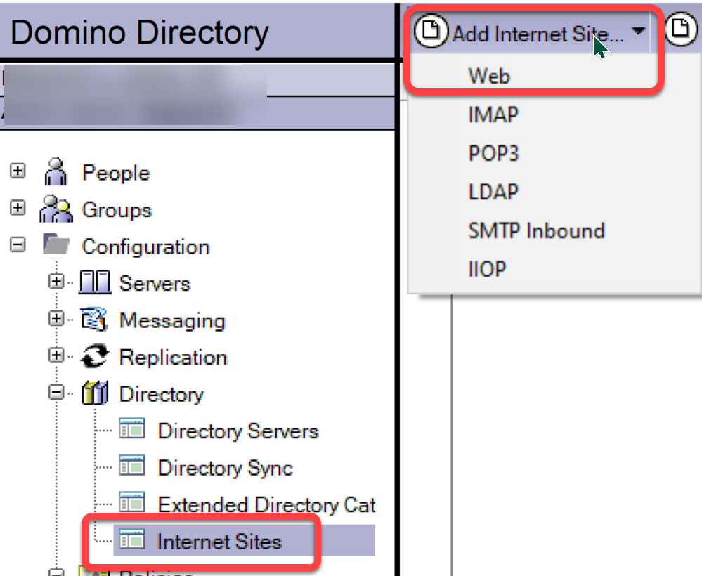
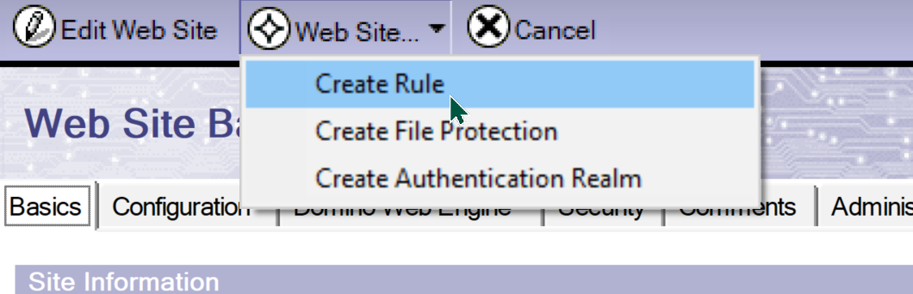
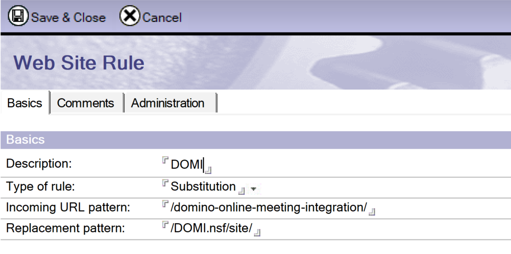

# GitHub Pages Sites on Domino 3: How

There are many ways to host static websites on Domino, and [Project KEEP](https://opensource.hcltechsw.com/domino-keep-docs) provides another option. In my scenario, for reasons I won't go into, hosting within the NSF made most sense.

<!-- more -->

GitHub Pages / Jekyll sites expect a specific base URL, defined in the **_config.yaml**. It may be possible to map that to a specific NSF filepath, but there is another option: **Internet Site Documents** with **Substitution Rules**. This does what it says, it substitutes an incoming URL pattern with a replacement.

## Internet Site

The first thing to do is to create, or ensure you have already in place, an **Internet Site Document** for the current server. For backwards compatibility, Domino still allows HTTP settings to be defined in the main server document, but the modern approach is to use Internet Site Documents, and enable this using the "Load Internet configurations from Server\Internet Sites documents" setting on the Basics tab of the server document.

The "Global Web Settings" does not work for substitution rules, it needs to be an Internet Site Document for the relevant host name.

## Substitution Rule

Once you have an Internet Site document created for the relevant host name, you are ready to create the Substitution Rule document. This is created as a response to the relevant Internet Site document, within the Internet Site document using the "Web Site...\Create Rule" button.

The **Type of Rule** needs to be set as "Substitution", then you just need to define the incoming root URL and the replacement pattern - whatever it should use instead of that part of the URL. I've shown an example with dummy values below, bear in mind the DOMI Jekyll template won't actually work as-is, because of the URLs the table of contents generates. But it gives sufficient detail to see what you need.

Be aware that after creating or changing the Substitution Rule, you will need to restart the Domino HTTP server - `res t http` is the command I always use, the ultimate abbreviation for `restart task http`.

## Content

There are a variety of places the contents of the _site directory could be pasted, some easier and more flexible than others. I've preferred an approach that is consistent with the NSF as an OSGi project - which is what it is for XPages. In an OSGi project, the `WebContent` directory is a special directory. If you put any content in here, it can be accessed directly within the NSF. If you have a "Foo.nsf" and put "bar.png" in the WebContent directory, you can go to a browser and - with the relevant authentication and authorisation as defined in the database ACL - you can go to "https://myserver.com/Foo.nsf/bar.png" and display the image.

Looking back at the Substitution Rule, the replacement pattern is "DOMI.nsf/site/". That means it's expecting the content in a "WebContent\site" directory. The main reason I did this was to make it easier for deleting and recreating the content - it's all self-contained. That means creating a "site" directory.

Firstly, this can't be done from the Applications Navigator view that developers are probably most familiar with. If you've done Eclipse development or written XPages Java classes the standard way, you're familiar with the Package Explorer view. This is the view in which to manage adding your Jekyll website into the NSF.

If it's a recently-created NSF, you will already have a WebContent directory with a WEB-INF directory inside it. This is where the xsp.properties file is found. The "site" directory can be created by right-clicking on the WebContent directory and selecting **New > Other...**. Under the "General" category, there is the option of **Folder**. Click **Next >** and enter the folder name "site". Then click **Finish**.

You should now have a site folder, ready to receive the content of your "_site" directory in the Jekyll website. Populating it is very easy, because you're now in the realm of standard Eclipse functionality. Open up Windows Explorer and navigate to the "_site" directory. Highlight all content and drag it across onto the "site" directory in your NSF. When prompted, choose "Copy files". You should now have all your content.

You will now be able to access your Jekyll website within the NSF, secured with whatever authentication you choose for the database ACL, with a URL that does not give any hint that it's within an NSF.

Yes, as mentioned, there may be some work to do to clean up the links, depending on the Jekyll theme used. And some optimisations may be required. But the Jekyll site can be composed using Markdown, look and feel managed centrally in templates and CSS (typically SASS / LESS), all versioned and backed up in source control, previewed locally quickly using `bundle exec jekyll serve`, and deployed to a Domino server by simply deleting the files in the "site" directory and copying the replacements in.

## Table of Contents

[Jekyll - Why](./2022-08-15-github-pages-on-domino.md) 
[Jekyll - What](./2022-08-16-github-pages-on-domino-2.md) 
Jekyll - How