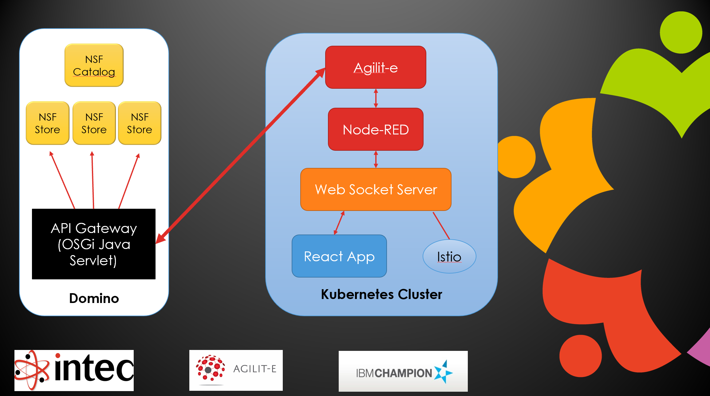

# Domino and JavaScript Development MasterClass Redux

Nearly six years ago I delivered a session at IBM Think with John Jardin called ["Domino and JavaScript Development MasterClass"](https://www.slideshare.net/paulswithers1/ibm-think-session-8598-domino-and-javascript-development-masterclass), a session I also delivered at Engage in May 2018. The session was delivered at the request of Andrew Manby, product manager for Domino. It was shortly after the first Domino Jams when JavaScript development against Domino was a key point of focus and it pre-dated any specific developments to expose Domino for JavaScript development. Now seemed a good point to revisit and review, not only in the context of Domino REST API and Volt MX Go, but also with the future of VoltScript in Volt Foundry.

<!-- more -->

I approached John because I didn't feel qualified to talk about building a JavaScript application. From my experience of customers and community, both at the time and since, that is not unusual for Domino developers. Nor is it specific to JavaScript - my impression is most Domino developers are equally unfamiliar with building web applications on Java, PHP or any technology outside Domino. So the separation seemed apt.

## Architecture

The architecture of the application we built is very important:

The JavaScript application talks via REST, reading and writing JSON. But the architecture very specifically talks about an **API Gateway**. Slides 15 and 16 go into greater detail about this. REST means basic CRUD access, whereas the focus on an API gateway emphasised coding for data quality, managing security, and ensuring specific data items are only editable via specific APIs - not via basic CRUD REST API.

## Development Approach

With John, our API began with writing a Swagger specification using OpenAPI 3.0. We then each coded against that, using the agreed specification. John coded the React application, possibly using mock data based on the OpenAPI spec. Meanwhile I coded the API gateway on the Domino side.

But this is where the challenge lay at the time and now - **coding** the API gateway on the Domino side. Neither then nor now is there a good approach for *coding* an API gateway on Domino. And it's not a problem specific to Domino for Domino developers. If they chose another NoSQL database, there is still no technology stack that would be *easy* for Domino developers to build an *API gateway*. The problem is not the *database*, it's *coding an API gateway*.

## Coding vs Configuration

The good news is Domino developers don't need to *code* the API gateway. Enter **Domino REST API**. Now, instead of *coding* the API gateway, they can just *configure* one. It should come as no surprise that Domino REST API handles the data quality requirements, security concerns and different exposures to the same data structures. Requiring certain data and validating input options, as well as exposing the same form with different configurations, these are all covered in Form Access Modes. No surprise there, I remember sitting with Stephan in the Manila lab working through how they would work. OAuth was added by Stephan, applications manage API keys and secret, and different scopes/schemas for the same database would handle managing scheduled endpoints differently. "Additional logging of transactions" is not currently handled out-of-the-box, but there are ways that could be handled with an additional scope/schema.

But you don't create a Domino REST API based on an OpenAPI specification. But because it's configuration instead of coding, why would you? Instead, Domino REST API *produces* the OpenAPI specification for you. Once schema and scope are created, you can view the OpenAPI 3.0 spec for the scope from the "OpenAPI v3" link from the Domino REST API homepage. And, because Domino REST API is API-first, you have an API to download the OpenAPI specification for any third-party consumer.

## UI

For our session, John built the UI application in React. Thankfully (and obviously) he shared the code with me. But even still, I would not profess to being capable of coding my next non-Domino application in React. Nor would I have a clue how best to secure it properly or scale accordingly. This was always the problem to solve for Domino developers building a web application outside Domino.

In a scenario mirroring what we had - a third party building the web front end - there's not a need. And yet the Domino developer can be confident that their Domino REST API configuration will ensure the third-party developer doesn't do anything they shouldn't do with either the database or the rest of the Domino server. Because, unlike a CouchDB or MongoDB server, the Domino server is the same web server that delivers the REST API gateway. And this is the crucial difference between Domino and other NoSQL database servers.

## Enter Volt MX Go

But what if the Domino developer wants to create the web application UI outside of Domino? Yes, of course there is no reason not to deploy the UI using XPages or Nomad Web, if they fit the use case. But if there is a need to use something else and it needs to be built by the Domino developer, whether it's React, Spring, Vaadin, Vue.js, or something else - many Domino developers including myself would not feel comfortable building with something.

This is why considerable effort has been invested into adding Domino-specific capabilities to Volt MX to produce Volt MX Go. Volt Foundry corresponds nicely to Agilit-e / Node-RED from the IBM Think session, being the middleware server that the UI talks to. The Iris application build in Volt MX Go corresponds to the React app John built. Iris and Foundry allow you to configure that middleware and build the front-end application with minimal web development skills. And integrating with an external database is standard for Volt MX, unlike many low-code platforms, particularly cloud-based ones, which can seek to lock data into their platform to ensure longevity of the front-end app.

## Configured vs Coded?

So the whole architecture John and I **coded** in 2018 can today be built by a Domino developer with zero coding on the API gateway side and minimal knowledge of JavaScript and HTML/CSS on the front-end.

But coming back to that bullet point about "additional logging of transactions", let's look further down the road. Volt Foundry orchestration services may solve this problem, I've only recently begun to understand what they offer and how they work. But in terms of coding, VoltScript in Foundry will certainly allow you to call multiple Domino REST APIs in a single Volt Foundry REST service. But that's future.

## Why Domino as Just a Database?

If XPages or Nomad Web deliver a web front-end that fits the needs, there is no reason not to use them. Then Domino is more than just a database, it's an application server as well. But that doesn't suit all use cases and all customers. And if it doesn't, why use Domino at all?

If a developer has the skills to build everything without Domino, they're probably not reading this. If they're a Domino developer, and definitely if they're a Notes (sic) developer, they probably don't have the skills to set up and secure another database, they almost certainly don't have the skills to code an API gateway using another database. Domino REST API and Volt MX Go will get to the same outcome John Jardin and I achieved in early 2018.
