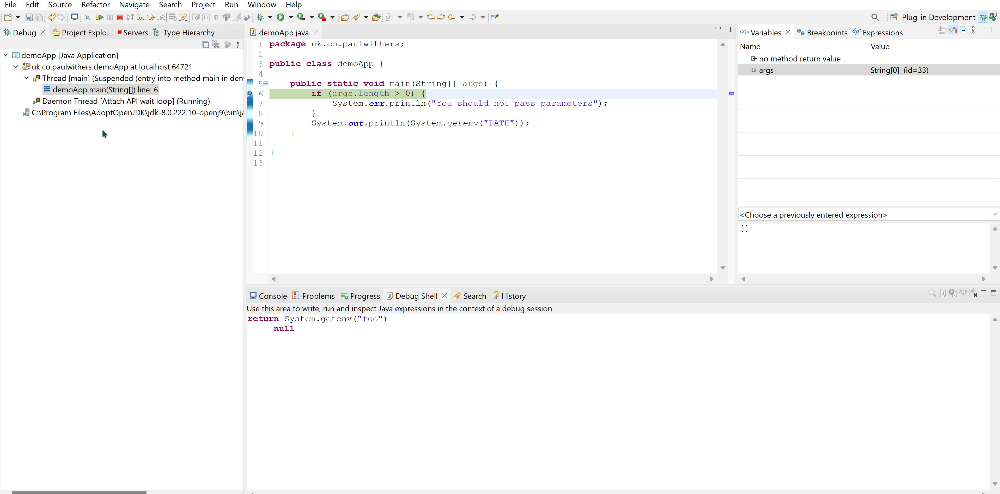

# Eclipse Java Debugging

When XPages came to Domino it introduced many Domino developers to Java. Because the IDE was based on Eclipse, it also introduced Domino developers to standard elements of Java development on Eclipse.

<!-- more -->

At the time I started developing Java in XPages, Java classes were created in a standard Java approach - in Package Explorer view, create a source folder in WebContent/WEB-INF and add it to the Build Path, create packages in the folder and Java classes within each package. This has the advantage of being standard for Java development when developing JAR or WAR files, as well as introducing developers to Project > Properties, Build Path as well as project-specific settings for project-specific Java Code Style and Compiler settings. It's well worth developers being familiar with these, I've come across them regularly in bigger Java projects. Even though many of the Java projects I've worked on use Maven, occasionally I've also had to add jar files to the build path based in a `lib` folder, as I also did for XPages. Although the JAR design element was added, the standard approach was still my preferred option, which has been helpful since.

## Class Files

Package Explorer was my standard view for coding Java and it's also been the standard view when developing Java projects in Eclipse. Project Explorer is another view, which also shows up in the Debug perspective. The main use for the Project Explorer view is being able to filter to display .class files. It's very easy when developing Java to forget that building the project generates the .class files and its those which are run. So knowing how to find them and view them can be useful.

And it's important to understand the build process. When developing Java applications in Eclipse, the default option of "Build Automatically" makes a lot of sense. In XPages it can cause problems for two reasons and because of two very specific differences between an XPages application and a Java application.

Firstly, when developing Java applications, the code is local and built locally. In XPages, the code is already in an NSF which can be on a remote Domino server. Consequently, building the application requires processing the .java files on the remote Domino server, generating the .class files and pushing them to the remove Domino server. So performance can be significantly different to developing a Java application.

Secondly, the Java application is exported as a WAR and deployed to a Java application server like Apache Tomcat or exported as a JAR and pushed to a remote environment where it is started using a JRE (Java Runtime Environment). In XPages, the Java code is in the NSF which is on the Domino server, so already in the deployment environment. So Build Automatically can impact the application in its running environment. This could just remove scoped variables (sessionScope, applicationScope etc) leaving other users confused with unexpected behaviour. Or it could sign code with an ID that does not have permissions to run the code, breaking the whole application.

So understanding the .class files that are generated is important for understanding the developer experience and managing your expectations.

## Debugging Java Applications

One of the major benefits of Java in XPages was the ease - and standardisation - of debugging. Those who developed Java agents in Domino databases will be aware of Bob Balaban's insightful "two-headed beast" approach to debugging Java agents. This requires copying the code into Eclipse and providing a separate entrypoint to the code.

But debugging Java in XPages - or Java OSGi plugins - was more standard. The approach for developing OSGi plugins is completely standard, adding an OSGi launch configuration, which generates a pde.launch.ini in `<Domino>/data/domino/workspace` directory.

The approach for Java development is mostly standard. One other notes.ini setting is more standard - `JavaDebugOptions=transport=dt_socket,server=y,suspend=n,address=8000`. The options passed - transport, server, suspend and address - are standard for debugging any Java application. The part before it is slightly less standard, it hides the reference to `agentlib:jdwp`, the Java Debug Wire Protocol. But the setting is essentially the same.

The other except notes.ini setting is less standard, `JavaEnableDebug=1`. This starts XPages - and potentially other Java programs running on the Domino server - in debug listening mode. In remote Java application servers like Apache Tomcat this is not done with a configuration setting, but by adding `jpda` when launching the server, e.g. `catalina.sh jpda start`. This can be used to debug any code deployed to the remote server, as long as you have the code locally. For example, in HCL Volt MX, this can be used to debug a Java integration server deployed to the Volt Foundry server.

Once the debugger is attached, the process of debugging is standard. Breakpoints are added by double-clicking the gutter. A caveat worth noting here is that a breakpoint that does not show a tick when the debugger is attached means the code there is not deployed to the server. This could happen if the project has not been built or if the latest code is not deployed to the server in the location it's being triggered from.

The debugger and functionality available is standard for all Java development. When the breakpoint hits, you are prompted to switch to the Debug perspective unless Eclipse has been set to always switch to it. I would recommend setting this, I've only ever used the Debug perspective when a breakpoint has hit.

Let's get acquainted with the Debug perspective. The **Debug** view in the left-hand part of the page shows the stack trace. There's not much to see here, but in a more complex Java application you will see much more. This can help you see where the code went before getting to the breakpoint, as well as navigating up the stack to see the variables etc at the point the code called the next method in the stack.

This brings us to the right-hand views.

**Variables** shows us all the variables available in the current class. If they're scalars, it will just display the value. If they're objects (instances of a class), you can expand them to see the properties for that instance. And you can expand down multiple levels. This is extremely important for checking whether the values are what you expect.

**Breakpoints** is pretty self-explanatory - it shows the breakpoints and allows enabling / disabling / deleting them. But if you click on a particular breakpoint, you can also set additional settings, like conditions for when the breakpoint should trigger. This can be particularly useful if a breakpoint could get hit multiple times because it's in a loop or triggered for different objects. You can set a condition so that it only hits on the nth iteration of a loop or if an object has a specific property value. The less skilled developer may just keep clicking continue as it hits the breakpoint over and over (which can still be a valid approach for a one-off debug), but the expert developer will identify the specific settings at the time to stop and set a condition accordingly.

**Expressions** is another useful view, possibly not as heavily used as it might be. This allows you to set new expressions - e.g. `args.length` or `System.getent("foo")` - which will be calculated every time you debug and allow you to see the value. This can speed up debugging by providing quick access to specific properties or the result of specific Java code.

So this gives us ways to find a property of an object or run specific code every time you're debugging. But more often than not you'll want to test the outcome of a method or run alternate code at a specific breakpoint. This is where the **Debug Shell** comes in. This allows you to enter code with a `return` statement and evaluate the code on-the-fly. The code must return something and it will print the result immediately below the code. You can keep chunks of code here to re-run on future occasions. But unlike the Expressions view, they are not evaluated automatically on future debug runs.

To evaluate code you need to highlight the relevant code - which can be multiple lines - then click "Display Result of Evaluating Selected Text", the second button on the right-hand header of the pane, the one that looks like a piece of paper with a "J" on it. The result will be printed immediately below the selected code. The fourth button - "Create a Watch Expression from the Selected Text" will add the code to the Expressions view, to auto-calculate it on future debug runs.

One caveat when writing code in the Debug Shell view is that classes need to have been imported into the current class in order to just use the class name (e.g. `String` or `HashMap`). If not, you can still use them provided they're on the classpath, but you need to use the fully-qualified name, e.g. `java.util.HashMap`.

## Debugging Server-Side JavaScript in XPages

I've done very little debugging of Server-Side JavaScript in XPages. Since I started writing Java, my usual rule of thumb was to write no more than a few lines of SSJS for any property / event. And all business logic was written Java, for ease of development, debugging and troubleshooting. So I'm not able to comment on what is similar / different for debugging SSJS. But I believe there are a number of similarities.
