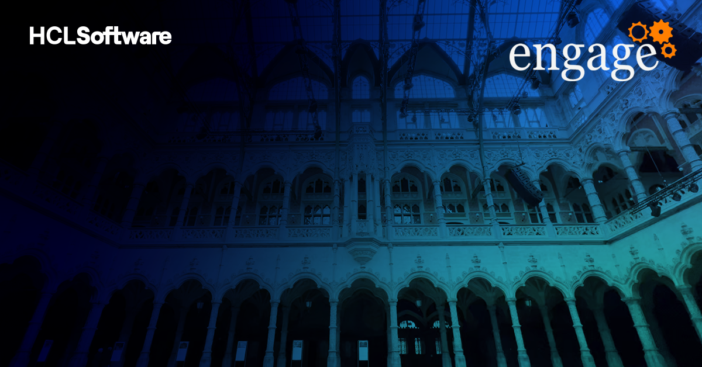
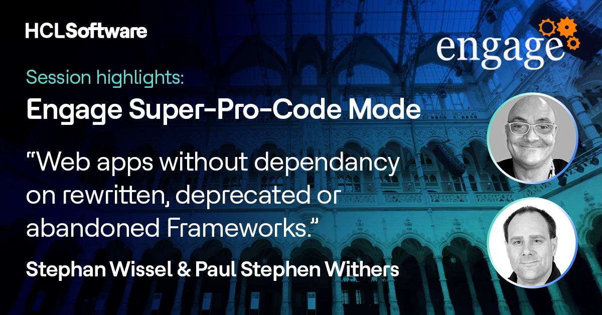
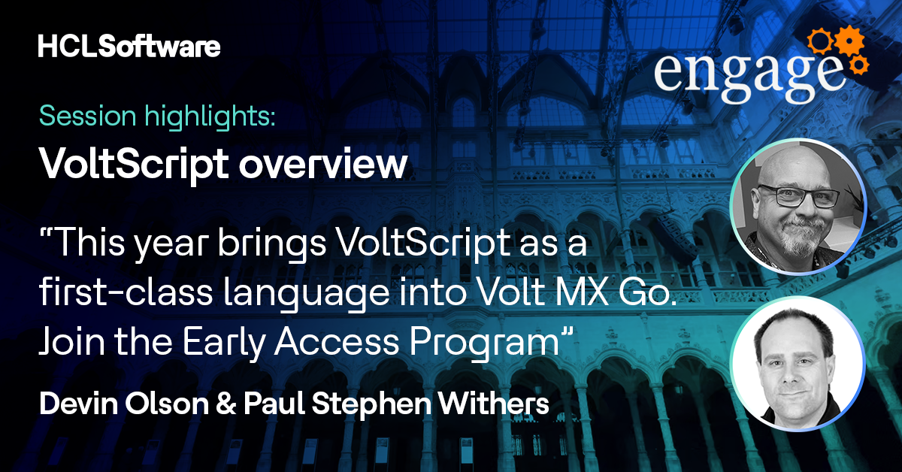

# Engage 2024

Later this month I will be attending Engage 2024. It will be a bittersweet experience. Engage was the first conference at which I spoke, a session that was way ahead of its time, highlighting the power of repeat controls in XPages and advocating against using View Panels. Ironically, at Engage this year, one of the sessions I'll be delivering has some similarities. But I'll cover the sessions I'm involved in chronologically.

<!-- more -->

## Volt MX Go for Domino Developers Workshop - Monday 22nd April 13:30, Hilton Antwerp Old Town

First up I'll be helping deliver the Volt MX Go Workshop, alongside any other HCLites with relevant expertise. Volt MX Go has a lot of power and benefit for Domino developers, even more so this year as VoltScript will be added to Volt Foundry, allowing developers with LotusScript skills to create custom REST services. There are a variety of other sessions about Volt MX during the conference, from HCLites, business partners and customers. They will highlight the power of Volt MX Go for integrating with non-Domino non-HCL solutions as well as creating web, mobile and desktop native applications.

## Engage Super-Pro Code Mode: Web Apps without Frameworks - Tuesday 23rd April 11:30, Room B

Next I'll be speaking with the uber pro-code expert, [Stephan Wissel](https://wissel.net), about how to develop modern web applications without frameworks, why you might want to and when you might not. The world of web development has moved on massively since XPages was launched 15 years ago, and hugely in just the last few years. There's a lot that can easily be done in vanilla web development now. But there are also valid scenarios where it's easier to leverage a framework. Domino REST API has also opened the doors to new opportunities.

## Introduction to VoltScript - Tuesday 23rd April 13:30, Room D

After a swift lunch, I'll be back speaking with Devin Olson about VoltScript. We've got a huge amount to pack into 45 minutes, showcasing the progress towards general availability later this year. The inclusion of VoltScript as a first-class language in Volt Foundry means all Domino developers can more easily create custom REST services and unleash the power of their Domino data securely for all technologies and developers.

## OpenNTF Guide to Open Source for HCL Products - Wednesday 24th April 8:00, Room A

The first OpenNTF session is highlighting a wide variety of open source solutions for the broad range of HCL products. You may know some, but we guarantee you won't know them all. So join the OpenNTF board members - and maybe some special guests - to find out some of what's available.

## OpenNTF Repair Cafe - Wednesday 24th April 15:30, Room B

We'll have 45 minutes to discuss your questions and topics, whether admin- or developer-related, at the in-person repair cafe. We can share best practices on any topic.

## Wrap-up

It's bound to be a busy conference, as always. And I look forward to catching up with friends and colleagues.
