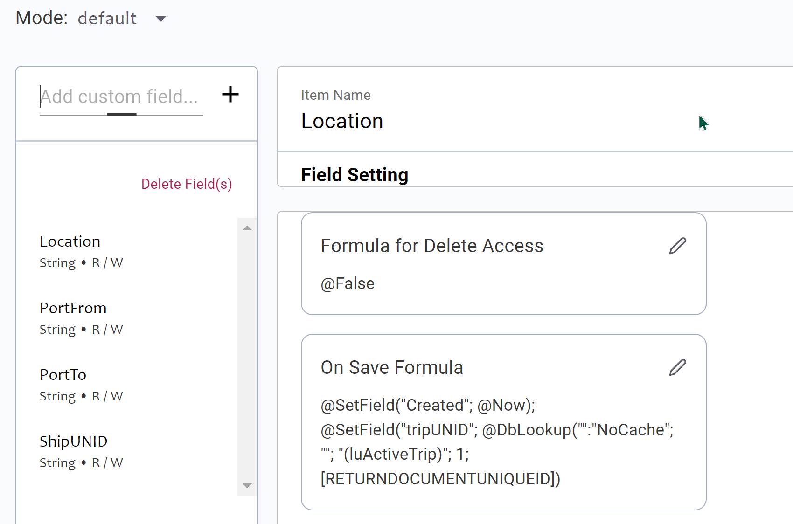

# Framework App to Web App: Part Four - DRAPI

Domino REST API is (in my admittedly somewhat biased opinion) the best easy method for creating a secure REST API into Domino. If you have very strong Java skills, an OSGi plugin using JAX-RS is the standard supported way. If you have good Java skills, Jesse Gallagher's JakartaEE project is the community approach. But even if you have those skills, Domino REST API may provide what you need. It certainly provides what I need for this project.

<!-- more -->

## Super-CRUD

Traditional NoSQL databases provide basic CRUD APIs. That works where for those databases, where access is strictly regulated and an API gateway built on top. But Domino developers rarely have the skills to create that API gateway. And Forms often have fields on them that are automatically set depending on the workflow step, only accessible to certain individuals at certain workflow steps, or require specific validation.

Domino REST API evolved with this purpose front and foremost - to allow developers to _configure_ access, to leverage Domino formula language skills, to keep code close to the database, to promote from dev to test to production environments leveraging Domino's in-built capabilities, and most of all to ensure the developers and administrators only allow a granularity of access.

A "super-CRUD" API, as it were.

And in this particular scenario, I'm configuring it with some quite advanced capabilities.

## Why First?

So why do all the configuration of Domino REST API first?

Well, I may be the only developer, but I will be developing using **mock data**.

Why do I do this? Well, first and foremost, it allows me to develop quickly offline. It also allows me to code the UI and test creating or updating data without polluting the database or sending bad data that then needs cleaning up. That has come in very useful. It's not something that's been possible with Notes Client or XPages development, because the database and the UI are inextricably bound together. But because I know and realise that, I can take advantage of the difference.

It also means I can test the configuration of Domino REST API without needing to build the UI first. That can come in useful.

Plus, it means I can visually look at the format of the data I'm working with as I'm writing the code. And I can test the API in Postman or [bruno](https://usebruno.com) to see what the response should be as I'm writing the code. This speeds up development.

But most importantly - and this is the key when developing non-monolith applications - it means I can verify at any point - before, during or after development - if a problem is because of coding in my UI or because of data issues. I will have the Postman or bruno collection and environments. So if I get unexpected results, I can quickly post the same data from another application. If it fails in both, it's a problem on the Domino end. If it works in Postman or bruno, I can compare the request with what I see in the Network tab of the browser to verify what's different. As a developer, you should always endeavour to have a way to verify the cause of a problem, to quickly rule out as much as possible, and provide comparable logs.

## Planning Data

First up, I'm configuring the Forms and Views. Key here is to understand the extent of the data being retrieved. HTTP is not the best protocol for sending and retrieving large amounts of data. On mobile devices, network connectivity varies, even in a country that has 4G or 5G. If a laptop is involved, VPNs can negatively impact network performance. I've sat next to someone who was going via a VPN, connected to the same website, and immediately received a reply on my laptop while theirs times out. And many developers (and admins) are not skilled at troubleshooting _why_ performance is bad.

Best to minimise the data sent.

HTTP/2 allows chunking of data. Domino REST API uses HTTP/2, it can do so because it provides its own HTTP server and does not rely on Domino's in-built HTTP server. But that's not a simple solution in itself. The code receiving the request needs to be able to take advantage of the chunking. If the language does not provide asynchronous handling of the response chunks, chunking on the sending side doesn't help. As Stephan pointed out in our session at Engage, Axios in a browser cannot deal with a chunked response. Even if it can handle chunked data, it might be far from straightforward to process the chunks, as [Stephan blogged about](https://wissel.net/blog/2023/07/handle-http-chunked-responses.html) when he found that JavaScript's `fetch` API doesn't nicely chunk as complete JSON objects. You need to manipulate the response to ensure you process only complete JSON objects.

So, again. Best to minimise the data sent.

### Local Storage

It may be possible to store some data locally on the device, depending on security. But again, it's important to know the amount of data. There are two storage options - [**localStorage**](https://developer.mozilla.org/en-US/docs/Web/API/Window/localStorage) and [**sessionStorage**](https://developer.mozilla.org/en-US/docs/Web/API/Window/sessionStorage). It's important to understand what they do and how they differ.

**localStorage** is stored locally for all browser tabs for the specific "origin", i.e. scheme, hostname, and port. It is not time-limited, the developer has to handle removing it. This can be done in the `onbeforeunload` event, calling `window.localStorage.removeItem(key)`.

**sessionStorage** is specific to the current browser tab, although it can be copied if you duplicate the tab. Unlike localStorage, it does get removed when the tab is closed.

Both are limited to 5MiB (mebibytes) according to [the documentation](https://developer.mozilla.org/en-US/docs/Web/API/Storage_API/Storage_quotas_and_eviction_criteria#web_storage). But your CRUD operations will need to update locally stored content as well as updating the remote systems.

There is another consideration to take into account here, one you may have encountered as a user. Updating local state may give the impression data has been successfully submitted to the server when it hasn't. It's important to handle failed updates, knowing if it's because of expired authentication, lack of response, or bad request. Some failures can be submitted again later. Some need rolling back. You may wish to leave handling failures until a later phase of (initial) development.

The final aspect of note for localStorage and sessionStorage are that the keys and values stored can only be [strings](https://developer.mozilla.org/en-US/docs/Web/API/Window/localStorage#description) and are in UTF-16 format. This may differ from what is sent.

Again, the benefit of creating the REST APIs first means you can check the size of the data.

I will be splitting the data across localStorage and sessionStorage. But none of the data from the server will be persisted between browser sessions. We want to ensure we get the up-to-date data each browser session. I also don't have to worry about multiple users. If I did, one option might be async periodic requests to the browser for updates, and modify localStorage or sessionStorage accordingly. Trying to implement websockets is complicated by needing to get notified of updates on various clients, which I personally wouldn't bother fighting to achieve.

## Agents

In this particular application, not surprising considering it was an XPages application, there are no agents to be used. It's important to understand what agent types can only be used from the Notes Client. It's also important to understand that the way the user is notified of success or failure will vary compared to Notes Client.

A typical use for agents can be for bulk updates or updates of related documents. Domino REST API provides specific endpoints for bulk updates. Updating related documents may best be handled by separate REST requests, chained. There is such a requirement in the previous incarnation of my app, with Trips. Creating a new Trip was intended to mark the previous Trip inactive. It never quite worked and I never bothered to solve it. It may not be required in the new application. But if it is, I will perform it with two separate requests:

- know the current active Trip UNID.
- create the new Trip.
- set the previous active Trip to inactive.

There's a process that has to be handled here, potentially with a need to roll back. But most Domino databases I've supported have not typically been coded to roll back a whole transaction in the event of a failure. There are ways to minimise the impact, like sorting the view of active trip both on whether it's active and date created descending.

## DQL

I mentioned bulk updates. Typically in Domino a full-text search or Database.search has been used. Database.search varies in its performance and should not be relied upon, particularly for the web.

Domino REST API doesn't use either, it only uses DQL. DQL, or Domino Query Language, was initially shown at the first HCL Factory Tour and released in Domino 10. It has had continued enhancements in subsequent releases, including after the retirement of its creator, John Curtis. DQL has three verbs - execute, parse and explain. This allows you to understand what it's doing and optimise the database for the query. To adapt a well-known phrase, there is great power here for those who want to take responsibility.

DQL is used to perform bulk get or update calls, either using the "/query" endpoint or the "/bulk/update" endpoint. Domino REST API has also added access to DQL's QRP views.

DQL will be used in this application for retrieving small collections of documents. Reporting will be done via view categories instead, to minimise the amount of data the server needs to send. Again, performing the statistical analysis on Domino and returning the numbers will be better performant than returning lots of data and performing the analysis on the browser.

## Locking Down Functionality

I don't need the ability to run code from Domino REST API here and none of the data is encrypted. SO I can turn off those settings. The way to do that is via the "Source" tab on the schema. This allows you to edit the overall schema's JSON object (more of that later). Edit buttons on each object or value allow you to change the settings. In this case I've changed "allowCode" and "allowDecryption" to false.

## Form Access Mode Specifics

There are a couple of specific tweaks I make to the Form Access Modes.

### Port Form

A Port has three fields: Port, Country and Abbreviation. The Abbreviation field is set based on the two-letter abbreviation for the relevant Country. In the XPages application, this was computed when the Country was selected. Technically, the browser made a REST request back to the server, retrieved the alias for the selected Country, and refreshed the page.

We can improve on that.

Domino REST API has an "On Save Formula" section. This allows you to run formula whenever a user saves a document with that Form at that Form Access Mode. In this case, I can set the Abbreviation dynamically during the save.

This improves in several ways. Firstly, the Port form only needs to contact the server on save, it doesn't need to round-trip to update the Abbreviation just to set on save. Of course we could have performed that update client-side based on local storage of the ports. But this way we ensure it _cannot_ be set incorrectly by a user, whether it's sent properly through the application, whether the browser's request is tampered with, or whether the request comes in via another source like Postman.

### Trip Form

Similarly, Trip form has an "On Save Formula" to set "Active" field to "Yes", a simple @SetField formula which I'm sure you can work out.

### Spot Form

In the XPages application, whenever a Spot was created, I set a field for the created date and mapped it to the current active Trip. Both can also be done with the On Save Formula. Spots were never updated outside the current Trip, but occasionally I forgot to create the Trip before creating the first Spot. We can improve here too, thanks to the "On Save Formula" again. We can look up the active Trip, and set its UNID.

## Required Fields

Any good REST API defines what is required when submitting content. I initially thought this was done via the "On Save Formula" or "Formula for Write Access". But "On Save Formula" is just to set fields, you can't use it to send back error messages if a value is not correct. And "Formula for Write Access" cannot be used to run formula against the submitted payload, it's just to check based on current saved values or database settings.

However, there is a way, again on the Source tab of the schema.

If you scroll down through the Forms and Form Access Modes, you'll see a setting for "required". This is an array of fields that have to have a value in order to save the document. Needless to say, I went through and set this on all Form Access Modes.

## Validation Rules

If you scrolled through the Source tab to see the "required" option, you probably also saw the "validationRules" option. This is a bit more complex, but even more powerful. "validationRules" are a formula type (currently just "domino"), a formula that **must** pass and an error message if the formula validation fails. You can have multiple validation rules, as you can see I've added here for the Ship form.

Here I'm validating that YearBuilt is 4 characters, that conversion to a number doesn't throw an error, and that the first two digits are "18", "19", or "20".

Again, the power of Domino REST API here is that this validation happens regardless of the application. It's not hard for a technically savvy person to look at the Network tab and test a request from a REST client like Postman or bruno. A more skilful developer might even use curl. Now, the data is validated according to the rules the Domino developer expects, no matter how the data got to Domino REST API - and good luck if you're a Domino developer trying to verify that it was indeed submitted through the application you expected it to be!

## Modifying Scope

With so much flexibility on Form Access Modes, it's a challenge finding a good user experience to customise everything. No wonder these aspects are not currently (as of August 2024) available in the Form Access Mode UI.

Here we've seen editing the scope via The "Styled Object" option in the Source tab. That validates the data types and helps you avoid mistakes. Two things to bear in mind are that it repaints the object whenever you submit a change. And you also need to remember to click the "Save" button when you've finished your edits.

Another option is to export the JSON (or perform a GET on the relevant API), and make the change via a REST API call. You can find the relevant request by going to the OpenAPIv3 page on your server, changing the drop-down at the top to the "setup" API, opening the "schema" section and going to "POST" for "/schema". You just need to get the schema format correct.

[!POST Schema](../../images/post-images/2024/drapi-6.png)

## Downloading Data

Once the schema and scope are set up, its easy to make Postman requests to test it works as expected. Then it's easy to download the JSON data ready to start development. That's what will happen in the next part. We will need to make another minor tweak to Domino REST API later on, but this is enough for us to start development.

## Table of Contents

1. [Introduction](./2024-08-15-xpages-web-1.md)
1. [Dev Tools](./2024-08-20-xpages-web-2.md)
1. [Frameworks](./2024-08-24-framework-web-3.md)
1. **DRAPI**
1. [Home Page](./2024-09-03-framework-web-5.md)
1. [Mocking, Fetch, DRAPI and CORS](./2024-09-16-framework-web-6.md)
1. [CSS](./2024-10-07-framework-web-7.md)
1. [Landing Page Web Component](./2024-10-21-framework-web-8.md)
1. [Services](./2024-10-23-framework-web-9.md)
1. [Ship Form Actions](./2024-10-30-framework-web-10.md)
1. [Ship Spot Component](./2025-01-13-framework-web-12.md)
1. [HTML Layouts](./2025-01-18-framework-web-13.md)
1. [Fields and Save](./2025-02-07-framework-web-14.md)
1. [Dialogs](./2025-02-08-framework-web-15.md)
1. [Spots](./2025-02-11-framework-web-16.md)
1. [Lessons Learned](./2025-04-02-framework-web-17.md)
1. [CSP Enhancement](./2025-04-19-framework-web-18.md)
1. [Spots By Date and Stats Pages](./2025-04-22-framework-web-19.md)