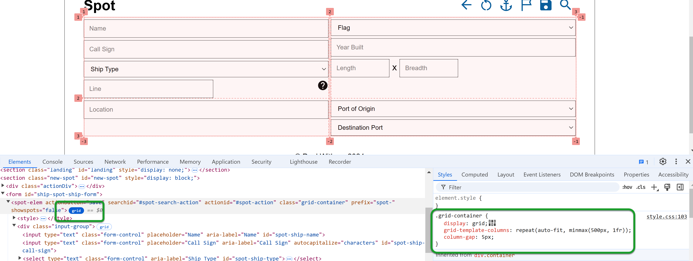
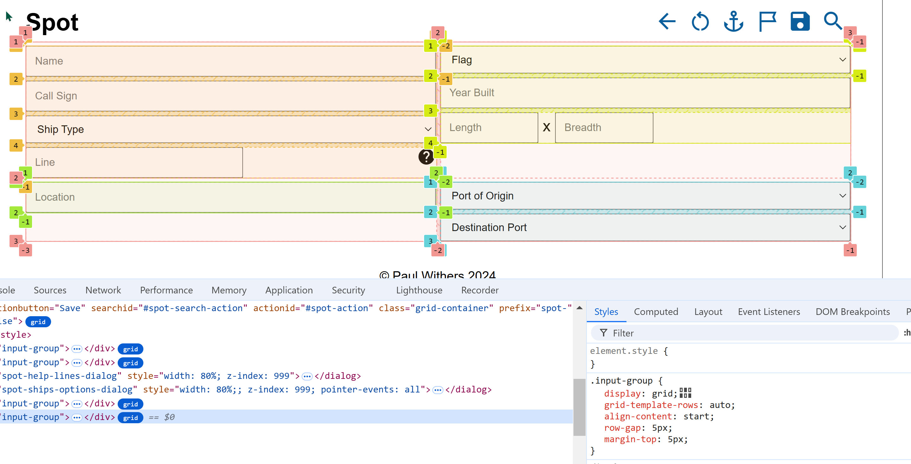
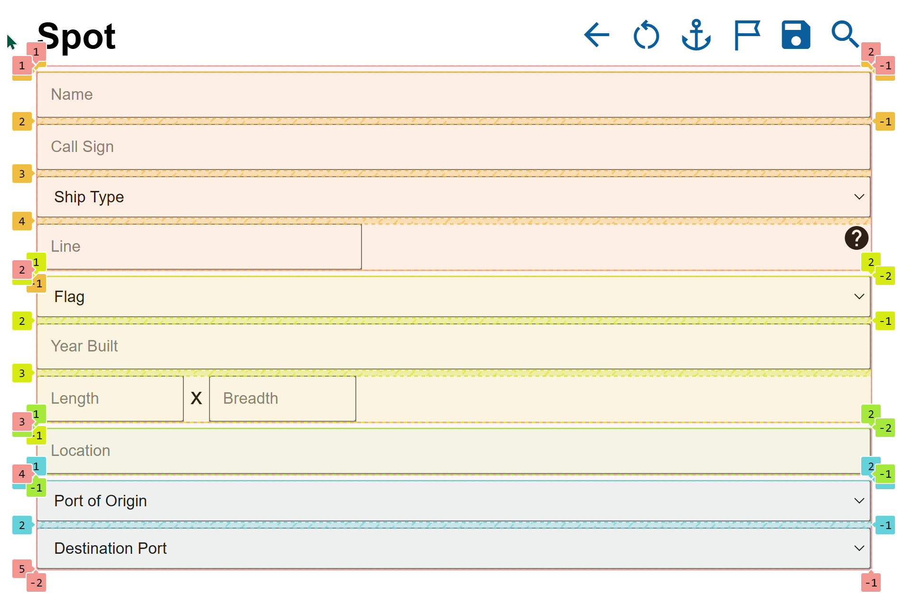

# XPages App to Web App: Part Thirteen - HTML Layouts

We've covered a lot of the Ship and Ship Spot basic web component JavaScript. But now it's time to dig into the HTML. But first, it's important to recap the landing page web component.

<!-- more -->

## Landing Page Flexbox

We covered the CSS for the landing page elements back in [part 8](./2024-10-21-framework-web-8.md). It was:

``` css linenums="1"
<style>
    .landing-container {
        display: flex;
        flex-wrap: wrap;
        align-items: stretch;
        justify-content: center;
    }
    .landing-tile {
        margin: 5px;
        font-weight: bold;
        font-size: 30px;
        color: light-dark(var(--primary-color-dark), var(--primary-color));
        background-image: radial-gradient(circle at center, light-dark(var(--landing-tile-start),var(--landing-tile-start-dark)) 15%, light-dark(var(--landing-tile-end),var(--landing-tile-end-dark)) 100%);
        height: 200px;
        width: 200px;
        box-shadow: inset 0 0 2px 2px light-dark(var(--border-color-primary),var(--border-color-primary-dark));
        border-radius: 10px;
        flex-grow: 1;
        text-align: center;
        align-content: center;
        cursor: pointer;
    }
</style>
```

The key parts here are lines 3-6 and line 18. This uses [CSS Flexbox](https://www.w3schools.com/css/css3_flexbox.asp){target="_blank"} to give a responsive layout. The `display` CSS property has been around for a long time and long-term web developers are very familiar with the values "hidden", "inline" and "block". But here the `landing-container` class, which is used for the div that contains the landing tiles, has `display="flex"`. This makes it a **flex container**.

We can then control various settings by applying additional CSS properties to the container. By default, the contents are displayed horizontally left-to-right, so we don't need to set **flex-direction**. When the tiles take up the full width, we want them to continue onto the next row, so we set `flex-wrap="wrap"`. There is also a **flex-flow** property that allows us to set both flex-direction and flex-wrap in a single property.

Then there are settings to control the content. **justify-content** allows us to control whether the items are left-justified (flex-start), centered (as we do here), or right-justified (flex-end). There are also other values that can be used to space the elements out. But what happens if they don't take up the full height? **align-items** controls this. But we don't explicitly define a height, so this isn't really used. There is also **align-content**, which controls the alignment of each row, whereas align-items controls how each item within that row is handled.

For the items themselves - each tile on the landing page - the key property is `flex-grow="1"`. This controls the relative size of each box, although we also control that with height and width. **flex-basis** could be used for the width, but would only give an initial width, which might not be what we want. On our landing page the content on each tile is always quite short with no risk of overflow, so this makes it a fairly simple layout. But flexbox provides a lot of flexibility for a one-dimensional layout.

## Ship and Spot Element Grid Layouts

When we come to the Ship and Ship Spot web components, flexbox doesn't provide everything we need. We want more of a form layout. This is where [CSS Grid](https://www.w3schools.com/css/css_grid.asp) comes in. This allows us to control both rows *and* columns.

CSS Grid is extremely powerful and flexible. It also allows you to make the layout responsive. But browser tools make it easier to work with as well. My preferred browser for development is Chrome. When you inspect an element in developer tools in Chrome, if an element uses CSS Grid you see a button that says "grid" beside the HTML tag. Clicking this allows you to inspect the grid in the browser, which can help identify layout issues.



The screenshot above shows the grid I'm using for the Ship Spot. Similarly to Flexbox, a div uses CSS Grid if it has `display: grid`. You'll see the second setting is **grid-template-columns**. This defines the number of columns the grid should have and, should you wish to define a number of rows, there is a corresponding **grid-template-rows**. The third setting is **column-gap**, which defines the size of the gap between the columns. There is a corresponding **row-gap** property to define the gap between rows and a **gap** property to set row and column gaps in a single property.

As with Flexbox, there are **align-content**, **align-items** and **justify-content** properties. But there is also **place-content**, which can be used to set both align-content and justify-content at the same time. The values you can use are different to Flexbox, but they do the same kind of thing - position within the grid.

But we need to come back to the grid-template-columns *value*. The value can be defined with a basic syntax, defining a fixed number of columns and sizing, e.g. `grid-template-columns: 80px 200px auto 40px`. This would define four columns, each of which will also be defined as a `div` HTML element: columns 1, 2, and 4 will have a fixed size, but column 3 will take up the remaining space. You don't specify the widths on the divs themselves, the grid layout automatically handles that. And if you add more than four divs, the grid layout will automatically wrap the subsequent divs onto new rows. And the same syntax can be used for grid-template-rows.

### Responsive

All this is great if you want a fixed layout. But what if the size of the browser window changes?

This is where **CSS functions** come in, specifically [repeat()](https://developer.mozilla.org/en-US/docs/Web/CSS/repeat) and [minmax()](https://developer.mozilla.org/en-US/docs/Web/CSS/minmax). Here the setting is `repeat(auto-fit, minmax(500px, 1fr))`. But I also have a media query:

``` css
@media only screen and (max-width: 768px) {
    .grid-container {
        grid-template-columns: repeat(auto-fit, minmax(300px, 1fr));
    }
}
```

**repeat()** takes two arguments, the number of times to repeat and what to repeat.

For the number of times, we could hard-code the number of times, but this wouldn't make it responsive. There are two keywords that can be used for responsive **auto-fit** and **auto-fill**. I would recommend reading [this blog post on css-tricks website](https://css-tricks.com/auto-sizing-columns-css-grid-auto-fill-vs-auto-fit/) to properly understand the difference. For this layout, auto-fit is what I want.

For what to repeat, we use `minmax()`, which takes a minimum size and a maximum size. The minimum size is either 500 pixels on a reasonably-sized desktop browser or a mobile device in landscape mode. On a mobile device in portrait, it's 300 pixels. The maximum is `1fr`, which will probably be unfamiliar. **fr** means "flex factor", a proportion of the remaining space. What this all means is that it will try to fit as many columns as possible into the width available, but will never make a column less than 500px, or less than 300px if the max-width of the screen is 768px (a mobile phone in landscape).

### Grids Within Grids

Now let's use developer tools to display *all* the grids:



The salmon-coloured numbers show the grid we've been talking about until now, with four cells. The numbers (1, 2, 3) show the start and end of a grid element, which can be used to map placement. But you'll notice there are also negative numbers on the right-hand size of each column and bottom of each row, which can be used to map placement working backwards from the end of the row or column.

But you'll notice there are four other grids with different coloured numbers. If you look at the HTML, these are the four divs inside the Ship Spot (`<spot-elem>`). The first two (and, incidentally, the two dialogs that follow them) are from the Ship class. The last two are from the Spot class. All of these have the class `input-group`, which is also a grid. This has a simpler layout.

``` css
input-group {
    display: grid;
    grid-template-rows: auto;
    align-content: start;
    row-gap: 5px;
    margin-top: 5px;
}
```

`grid-template-rows` sets that rows have an automatic height, which works fine because we're using inputs. We set a gap between rows at 5px, but also add a top margin of 5px to ensure it looks like there's a row gap between each div. We also set `align-content: start`. This becomes useful in the right cell of row 1 and left cell of row 2. It means the inputs there are aligned to the start of the grid cell even though they have less content.

But why lay it out like this? It becomes clearer when we reduce the browser window size.



Compare the two and you now see we get the ship fields first and the spot fields afterwards. But because each inner grid is its own "row" now, `align-content` is effectively irrelevant now.

### Testing Alignment

If you look at the CSS with `display: grid`, you'll see an icon displayed after the semi-colon. This isn't in the CSS file, it's added by developer tools and, like the "grid" button next the the HTML elements, it's also clickable. It allows you see and change options for align-content, align-items, justify-content, and justify-items. It also gives little images to help understand the differences. It's another example of the browser tools helping.

### Subgrid

In my layout, I'm just using input fields with placeholders to identify what they should enter. The Line row is the only one that has any other content, a link to see the lines previously entered. This is a pretty simple layout, and the approach, which doesn't necessarily cover best practices for full accessibility coverage, is one that is both acceptable and preferable for the user base (i.e. me!).

But if you need more complex layouts, you should look into [Subgrid](https://developer.mozilla.org/en-US/docs/Web/CSS/CSS_grid_layout/Subgrid), which gives a lot of power for controlling the layout of inner grids and passing settings down.

But that's beyond the scope of this blog series and this application.

## Summary

For those who have been using tables for the last 20+ years, you may start to see a better option for form and table layouts. There is immense power and flexibility in both Flexbox and CSS Grid, and it may take some playing about with to find the right settings you want. But it's definitely the way forward. In the next part we'll cover some validation and field setting options.

## Table of Contents

1. [Introduction](./2024-08-15-xpages-web-1.md)
1. [Dev Tools](./2024-08-20-xpages-web-2.md)
1. [Frameworks](./2024-08-24-framework-web-3.md)
1. [DRAPI](./2024-08-26-framework-web-4.md)
1. [Home Page](./2024-09-03-framework-web-5.md)
1. [Mocking, Fetch, DRAPI and CORS](./2024-09-16-framework-web-6.md)
1. [CSS](./2024-10-07-framework-web-7.md)
1. [Landing Page Web Component](./2024-10-21-framework-web-8.md)
1. [Services](./2024-10-23-framework-web-9.md)
1. [Ship Form Actions](./2024-10-30-framework-web-10.md)
1. [Ship Search and Save](./2024-12-14-framework-web-11.md)
1. [Ship Spot Component](./2025-01-13-framework-web-12.md)
1. **HTML Layouts**
1. [Fields and Save](./2025-02-07-framework-web-14.md)
1. [Dialogs](./2025-02-08-framework-web-15.md)
1. [Spots](./2025-02-11-framework-web-16.md)
1. [Lessons Learned](./2025-04-02-framework-web-17.md)
1. [CSP Enhancement](./2025-04-19-framework-web-18.md)
1. [Spots By Date and Stats Pages](./2025-04-22-framework-web-19.md)