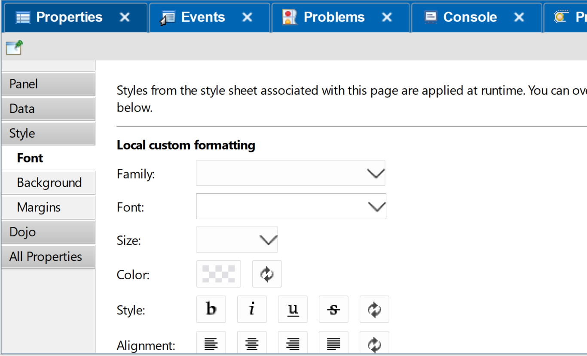
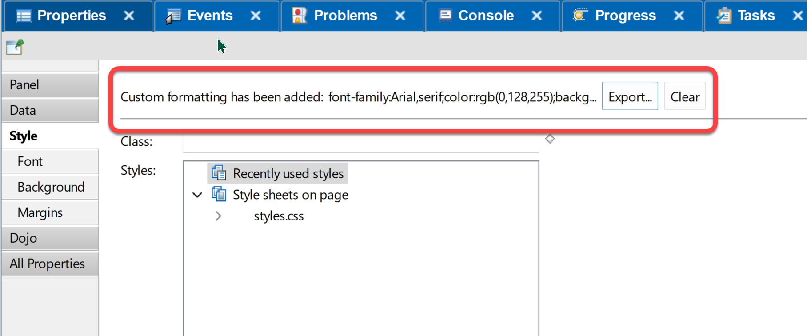
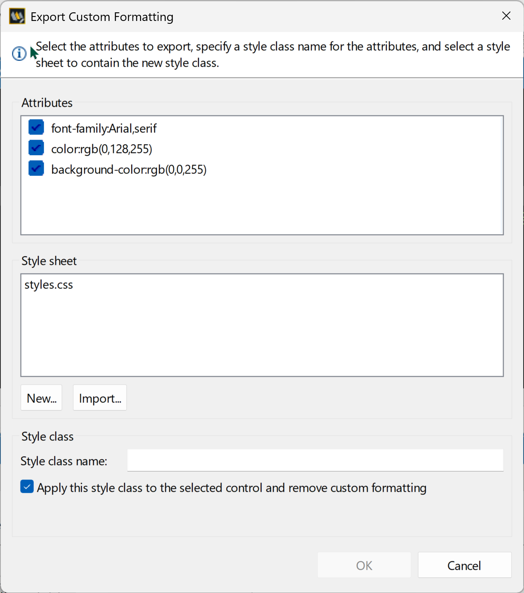

# Avoiding Inline Styles in XPages

Recently there have been discussions about inline CSS in XPages. The absence of anyone mentioning a feature in XPages prompted me to eventually ask about a piece of functionality relevant to this.

<!-- more -->

## To Inline or Not Inline

The trigger for the discussions was a change in how XPages handles inline CSS, because CSP (Content Security Policy) [blocks inline styles](https://content-security-policy.com/examples/allow-inline-style/) as well as inline JavaScript. This can be circumvented by setting `unsafe-inline`, but [this is not recommended](https://developer.mozilla.org/en-US/docs/Web/HTTP/Reference/Headers/Content-Security-Policy#unsafe-inline).

I'm not interested in the rights or wrongs of inline content (and there are plenty of opinions on the internet about it) or how the problem was addressed in XPages. I also know there are XPages applications I built which still have inline styles, because XPages allowed me to do it. But there's a way to avoid it and solve it, at just a click of a button. And it appears many XPages developers are not aware of it, even though I was teaching about it in XPages courses over a decade ago.

## XPages and CSS

Domino has had StyleSheet design elements since Domino 6, over twenty years ago. But when XPages was introduced, many developers were still unfamiliar with CSS. So XPages provided a no-code option for adding CSS, with Font, Background, and Margins tabs with various pickers on "pretty panels", as Maureen Leland called them.

{ width="500px" }

There were two ways to use these. The first was to primarily use the no-code option. The second was to use it to minimise the amount that was new, but once comfortable with the new IDE, learn CSS and progress to code over GUI. This is similar to SSJS: one approach was to only ever use SSJS; the other was to use it while learning the IDE and then move to Java.

The difference that CSS pretty panels provided was that it provided a quick and easy way to move the CSS to a stylesheet. It's probably not noticed because it's on the parent `Style` tab, and only appears when inline styles have been added. It is the **Export** button, as in this screenshot.

{ width="600px" }

When you click this, you can export all styles to a stylesheet of your choice or cherry pick which styles to add. It also allows you to replace the inline styles.

{ width="500px" }

What this means is that manually moving inline styles to comply with CSP settings is very easy - in fact probably easier than in standard web development, if developers wish. The inbuilt Eclipse Search menu functionality in Domino Designer will allow you to search for `style=` on just XPages and Custom Controls, to easily find where you need to change. Because they're textual design elements, the Eclipse search is well-suited to the task.

This really falls into the aspect of "app modernisation" - updating dependencies, leveraging new functionality and coding options, removing previously deprecated code, minimising technical debt, leveraging standards to maximise frugal engineering. Investing your time this way means modernising your skills, giving you learning to share with the community and encourage others to get the most out of Domino development.

## Inline Styles in Recent Blog Posts

I'm also fully aware that in my recent "XPages to Web App" series, I was using inline `style` tags in web components. Firstly, the application is built by me and only used by me, so there's no need for this application to comply with Content Security Policy 2.0 and 3.0. But I've also investigated since how web components solve this problem, and I found a variety of solutions several weeks ago. In due time I'm sure I'll modify the app to remove the inline style - mainly to learn more than just the theory of implementing it, so I *know* how to do it when I need to.