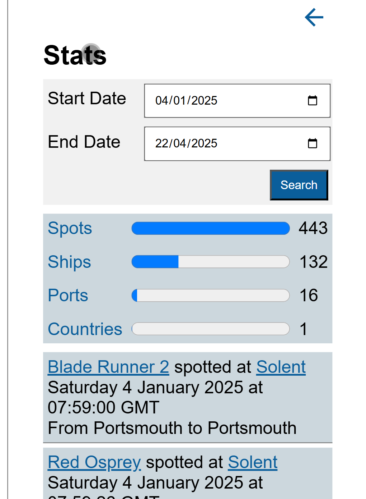

# XPages App to Web App: Part Nineteen: Spots By Date and Stats Pages

Back when the application was on XPages and spots were associated to a trip, there was a summary page that gave stats for the number of new spots, ships, ports, and countries during a trip. Now the requirement for trips has gone. But sometimes it's nice to see details of new documents across a period of time. So over the weekend, I added that functionality. This was very similar to a Spots By Date page, which I had not yet covered. So we'll cover both together.

<!-- more -->

## Getting The Data

The first thing to clarify is how the trip statistics were generated previously, and why it had to change. Previously, a Trip document was created and this became the active trip. Then, whenever a document was created, it got stamped with the active trip UNID. This meant any statistical reporting could use a view, categorised on trip UNID, with sub-categories for each form type and totals on them.

The method of retrieving the data is noteworthy. Many Domino developers would just instinctively create a ViewEntryCollection and iterate them. But my approach, and one I had used for many years, was to use a **ViewNavigator**. ViewNavigators in XPages were better optimised than ViewEntryCollections as well as providing cache options and a max level. This meant I could create a ViewNavigator that *ignored all actual documents*.

With DRAPI, there were also optimisations that could be made and this is even more important when returning JSON over HTTP for processing in JavaScript. Hopefully all DRAPI developers are fully conversant with all the options on the "/lists/{name}" endpoint. But using **category** or **key** options allows restricting to the selected trip UNID. Then **scope** can be used set to "categories", to ignore actual documents. **meta** can be set to false, to suppress metadata for the view entries.

But now, the application no longer has trips. So the reporting needs to be based on dates. So a view won't work. Similarly, for the Spots by Date page, this also needs to be based on a start and end date.To achieve this we need to use **DQL**.

!!! tip
    If you make a DQL query trying to retrieve thousands of documents, you're going to create a problem for yourself, same as trying to retrieve thousands of documents from a view. Even though DRAPI chunks data so you can deal without before waiting for the final chunk of data, you're still making it harder for yourself to provide a good user experience. The less data you stream to the browser, the better the user experience will be. And consider your own usage of the biggest database of all - Google: no sane person ever scrolls through hundreds of documents, they want to find the right document quickly, perform whatever action they wish upon it, then move on. So why give users a view of thousands of documents?...other than because that's what you've done for the last twenty years in your Notes Client applications.

    So what about reporting? If I wanted to get data for more than a small number of days, I would provide selectors for a start **month/year** and end **month/year**, and use a categorised view, getting categories and without metadata. I may use one view for the last 12 months, and any further back I would provide either rolling year or calendar year. Thus the "/lists/{name}" endpoint would return maximum 12 (months) x 4 (forms) JSON objects.
    
    But the key here is that I've thought about the reporting. And I'm not afraid to tell myself or others to think about it and then provide specific reporting. And for historic data, there are things called file servers.

Okay, so we've identified it's a DQL query, between two reasonably close dates, not selecting something like start date of 01/01/2021 and end date of 04/04/2025. So this is going to be using the "/query" endpoint. This is a POST request that takes a JSON object containing DRAPI details - `forms` and `mode` - and standard DQL settings. The `getSpotsByDate()` query and `getStatsByDate()` query are virtually identical. The only difference is the array of forms to return, just comprising `["Spot"]` for `getSpotsByDate()`, whereas this for the `getStatsByDate()`:

```js
const bodyObj = `{
    "forms": [
        "Spot",
        "Ship",
        "Admin_Country",
        "Admin_Port"
    ],
    "includeFormAlias": true,
    "maxScanDocs": 500000,
    "maxScanEntries": 200000,
    "mode": "dql",
    "noViews": false,
    "query": "@Created >= @dt('${startDate}') and @Created <= @dt('${endDate}')",
    "timeoutSecs": 300,
    "viewRefresh": true
}`
```

We're not using aliases, but for ease we set `includeFormAlias` to true. We should never hit the `maxScanDocs` or `maxScanEntries`, but we go with the defaults. The query uses the `startDate` and `endDate` JavaScript variables passed into the functions. These are dates only, but can use them to map to `@Created`, and DQL will return the correct data. The processing of the response is identical to all the other DominoService functions.

``` tip
    Three pro tips here:

    1. Have an agent using LotusScript (or Java if you have to) to perform a DQL query. Use this to cross-reference and make sure your DQL syntax and return are as expected. I also use Postman or the new [**bruno** collection](https://opensource.hcltechsw.com/Domino-rest-api/references/downloads.html#bruno) to cross-reference the DQL data returned with what I get via code, to provide another cross-reference point, this time with DRAPI added into the mix. *Everything* in IT is a process, and if you don't use the skills at your disposal to pinpoint which step in the process is failing, you're going to make your life harder.
    2. DRAPI filters the DQL results based on the form mode (`mode`) passed. If the mode doesn't exist for that Form, you don't get the document. If there is a mode, but the current user doesn't map to the read access for that mode, you don't get the document.
    3. You can create a specific mode that returns the minimum possible fields you need. This can also ensure the JSON returned is as small as possible.

Not surprisingly, if you remember where this tutorial started. I generated some data via bruno as mock data for me to develop against using my "John Doe" user. This was loaded from a `getStatsByDate()` function in the MockService class, paralleling the `getStatsByDate()` function in the DominoService class. Because it was a while since I last built that sample data, I also needed to re-run the Ship data. But now I'm ready to start developing the new page.

!!! tip
    If you're doing reporting across multiple categories, "/listspivot/{name}" is well worth getting familiar with. It's used against a flat view to pivot (or group) the data on a specific column and provides minimum, maximum, count and sum for all other columns. Of course minimum, maximum, and sum are not so helpful for alpha columns. But this provides powerful and succinct data for reporting. And it can also be refined based on keys.

## Adding the New Page

On the index.html, we need to add new section for the web component, with back buttons and titles. We'll call the new HTML elements `<ship-spots-elem>` and `<stats-elem>`.

On the index.js file, there are six steps:

- load the JavaScript classes we're going to create, in the same way we loaded all the other web components.
- add to the `spaSections` array, for the new sections.
- add to the `tiles` array.
- add an event handler on the new back button.
- register custom event handlers for `loadSpotsByDate` and `loadStatsByDate`.
- add functions for `loadSpotsByDate` and `loadStatsByDate` to call the Domino / Mock service functions and process the response.

`loadSpotsByDate()` takes the `shipSpotElem` object that will have a start date, end date, and a `populateSpots()` method.

```js
const loadSpotsByDate = async (event) => {
	const shipSpotElem = event.detail.shipSpotElem;
	console.log("Getting spots between " + shipSpotElem.startDate + " and " + shipSpotElem.endDate);
	const endDate = shipSpotElem.endDate;
	const json = await window.dataService.getSpotsByDate(shipSpotElem.startDate, endDate);
	if (typeof(json) === "object") {
		json.sort((a,b) => {
			if (a.Created < b.Created) return -1;
			if (a.Created > b.Created) return 1;
			return 0;
		});
		shipSpotElem.populateSpots(json);
	} else {
		statusError("Error getting spots: " + json);
		removeMask();
	}
}
```

The key difference here is that if we return a JSON object, we sort the data on created date. This gracefully does nothing if an empty array was returned. If no JSON object is returned, it will be because we returned a string error message from DRAPI.

For `loadStatsByDate()` the if statement is slightly different.

```js
    if (typeof(json) === "object") {
		if (json.length === 0) {
			statsElem.populateStats(json);
		} else {
			json.sort((a,b) => {
				if (a.Created < b.Created) return -1;
				if (a.Created > b.Created) return 1;
				return 0;
			});
			const groupedJson = Object.groupBy(json, ({ Form }) => Form);
			statsElem.populateStats(groupedJson);
		}
	}
```

We want to sort on date first, but then group on Form. `Object.groupBy()` has been baseline supported in browsers for some time, so it makes sense to use that. To avoid any potential problems, if we got an empty array back for the query, we just pass that to `statsElem.populateStats`.

## statsObj Web Component

The HTML template is similar for both web components. This is the bulk of it for the stats web component:

```html
<link href="./forms.css" rel="stylesheet" type="text/css">
<form>
    <div class="col">
        <div>
            <label for="stat-start">Start Date</label>
            <input type="date" class="form-control" placeholder="Start Date" aria-label="Start Date" id="stat-start" />
        </div>
        <div>
            <label for="stat-end">End Date</label>
            <input type="date" class="form-control" placeholder="End Date" aria-label="End Date" id="stat-end" />
        </div>
        <div class="actionBtn">
            <button id="stat-search-btn" aria-label="Search" type="button" class="btn-primary">Search</button>
        </div>
    </div>
</form>
```

We're adding a shadow DOM, so we load the forms stylesheet. Colour variables allocated to `root` in the theme stylesheet are available even to the shadow DOM, so we don't need to load that. Then we have a Start and end date, and a search button. We could add min and max values to the inputs. But as I'm the only user, I won't bother.

Below the form, we add a div to hold the results. For the spots, that's sufficient, because like the list of spots on a ship, this list gives us everything we need. However, on the stats form, the div to hold the results will give summary figures only. So we'll add a second "details" div.

Following the CSP enhancements in the [last part](./2025-04-19-framework-web-18.md) we'll add a stylesheet. I'll just cover the CSS for the selection form for now:

```js
.col {
    display: grid;
    grid-template-columns: repeat(auto-fit, minmax(260px, 1fr));
    gap: 0.5rem;

    div {
        display: grid;
        grid-template-columns: 100px 1fr;
        gap: 0.5rem;
        align-items: baseline;
    }
        
    .actionBtn {
        grid-template-columns: 1fr;
        justify-items: end;
    }
    
}
button {
    padding: 0 0.5rem;
    height: 1.75rem;
    cursor: pointer;
}
```

For a desktop browser, we put the two fields and the button on the same line. Because we're using a repeat on the `col` grid, on a mobile device they will display on separate lines. The date selection divs are also grids, with two columns. But the `actionBtn` div is a single column, with its contents justified at the end of the column. This ensures the button appears at the end of the line, which looks better.

The `ShipSpot` component for the spots by date extends the `Spots` component created in [part 16](./2025-02-11-framework-web-16.md#spots-web-component), with a `dateOptions` array to handle consistent date format. During the `render()` function we add an event handler onto the button to call the `doSearch()` function. Again, that's very similar between the two web components, and just validates the start date, defaulting end date to the same if not set, and dispatches an event for the index.js to catch:

```js
doSearch = () => {
    this.startDate = this.root.querySelector("#stat-start").value;
    this.endDate = this.root.querySelector("#stat-end").value;
    if (this.startDate === "") {
        this.dispatchEvent(new CustomEvent("sendUserMessage", { bubbles: true, detail: {type: "error", message: "Start Date is required"}}));
        return;
    }
    if (this.endDate === "") {
        this.root.querySelector("#stat-end").value = this.startDate;
        this.endDate = this.startDate;
    }
    this.dispatchEvent(new CustomEvent("mask", { bubbles: true, detail: {show: true}}));
    this.dispatchEvent(new CustomEvent("loadStatsByDate", { bubbles: true, detail: {statsElem: this}}));
}
```

## Displaying Results

Displaying the results for the spots by date is similar to the code in part 16 for spots by ship. The main difference is we also need the ship details. So we just need to get the ships JSON from localStorage (to ensure it's up-to-date) and filter where UNID is the same as the spot's ShipUNID. The code itself should be easy enough to follow, so I won't go into details.

For the stats, it's slightly different. Here we're going to do two things:

1. Add a graphical summary of numbers of new documents for each form type.
2. On click of each form type, display details.

### Graphical Summary

Just to remind you, the JSON object we got back was details, grouped on form type. We'll load that into a property of the web component, so we can reference it if the user clicks on each label. And we'll also pull the ships from local storage as well. It won't change between the user clicking each label, only (potentially) if the user does another search. If the array is empty, we'll display a message saying "No stats found", otherwise we'll load the summary.

Spots will always have the highest number: there's no reason to create any of the other form types unless also creating a spot. So we'll set that as our max for all bars. We only have a specific set of form types, so our code will just look for each:

```js
const max = value.Spot.length;
const spotProg = this.createProgressBar("Spots", "Spot", max, max);
spots_container.appendChild(spotProg);
if (value.Ship) {
    const shipProg = this.createProgressBar("Ships", "Ship", max, value.Ship.length);
    spots_container.appendChild(shipProg);
}
...
```

We call a `createProgressBar()` function passing label, form name (which is the key we grouped on), the max for the bar and the actual number of documents for this form type. This is the code for each "row".

```js
createProgressBar(label, key, max, value) {
    const div = document.createElement("div");
    div.className = "summary";
    const labelElem = document.createElement("label");
    labelElem.setAttribute("for", label);
    labelElem.innerHTML = label;
    labelElem.addEventListener("click", (event) => {
        event.preventDefault();
        this.loadDetails(key);
    });
    div.appendChild(labelElem);
    const progress = document.createElement("progress");
    progress.setAttribute("max", max);
    progress.setAttribute("value", value);
    progress.setAttribute("aria-label", label);
    progress.setAttribute("id", label);
    div.appendChild(progress);
    const span = document.createElement("span");
    span.innerHTML = value;
    div.appendChild(span);
    return div;
}
```

We create a clickable label which will load details for the key in the JSON object. We then create a `<progress>` HTML element, which has been baseline for a decade. We finally add a span for the number, so the user can easily see the actual number of new documents at a glance. We could choose a charting library, pull it in, and try to load numbers and labels. But all we really want is a label, a bar that gives comparative sizing between each form type, and a number. Purists might prefer a proper chart. But this provides the information I want in a satisfactory UI, quickly, easily, without additional dependencies. I'll let others fight with charting libraries, while I'm spotting ships at the beach with a beer!

#### CSS

Let's also look at the CSS for this graphical display:

```css
.stats-container {
    display: grid;
    grid-template-columns: auto 1fr auto;
    gap: 5px;
    align-items: center;
    background-color: light-dark(var(--spot-background), var(--spot-background-dark));
        
    .summary {
        display: contents;

        label {
            padding: 5px;
            cursor: pointer;
            color: light-dark(var(--button-primary), var(--button-primary-dark));
        }

        progress {
            width: 100%;
            block-size: 1.5rem;
        }

        span {
            padding: 5px;
            justify-self: flex-end;
        }
    }
}
```

The main container has three columns, the ones for the label and the number of new documents set to `auto` and the one for the progress bar taking up the remaining space. `align-items: center` means they all line up nicely vertically in the middle of each bar. We add a background colour, as always using `light-dark()`.

The summary div, which contains all elements for each form type, is set to `display: contents`, so it's in the DOM but ignored for CSS Grid. That means we can't add any styling to it, but it makes it easier to see the elements with developer tools.

The label is styled like a link with padding so it doesn't appear flush against the left, top, and bottom of the grid. The progress bar is set with full width, so it takes up all available space in the grid cell, and `block-size: 1.5rem` to make it a bit thicker. The span for the number of documents is also padded, for the same reason as the label, and with `justify-items: flex-end` so it is right-aligned.

One points on browser coverage: I've noticed that the progress bar thickness isn't modified by `block-size` on iPad, whether in Safari or Chrome. I've no idea why, but that's rarely what I use. So I haven't bothered troubleshooting or trying to resolve.

### Details

The `loadDetails()` function clears the `detailsContainer` and loads data from the relevant document type for each document. For ships, it also provides a link to open the relevant Ship. For ports and countries, it just displays summary information - there is no expectation to edit those documents. Spots is the most complex and modelled on the display on the "Spots by Date" page, so I'll show that in full:

```js linenums
loadSpot(spot, index, div) {
    const shipUnid = spot.ShipUNID;
    const filtered = this.ships.filter(obj => obj["@meta"].unid === shipUnid);
    const shipDiv = document.createElement("div");
    shipDiv.id = `spot-${index}`;
    const a = document.createElement("a");
    a.href = "#";
    if (filtered.length === 0) {
        console.error(`Could not find matching ship ${shipUnid}`);
        a.innerText = "No matching ship";
    } else {
        if (filtered.length === 1) {
            a.innerHTML = filtered[0].Ship;
        } else {
            console.error(`${filtered.length} ships match ${shipUnid}`);
            a.innerHTML = filtered[0].Ship;
        }
        a.addEventListener("click", (event) => {
            this.dispatchEvent(new CustomEvent("showShip", { bubbles: true, detail: {shipObj: filtered[0]}}));
        })
    }
    shipDiv.append(a);

    const span = document.createElement("span");
    span.innerHTML = "&nbsp;spotted at&nbsp;"
    shipDiv.append(span);
    const locLink = document.createElement("a");
    locLink.href = "#";
    locLink.innerText = spot.Location;
    locLink.addEventListener("click", (event) => {
        if (filtered.length > 0) {
            this.dispatchEvent(new CustomEvent("showSpot", { bubbles: true, detail: {shipObj: filtered[0], spotObj: spot}}));
        } else {
            this.dispatchEvent(new CustomEvent("showSpot", { bubbles: true, detail: {shipObj: null, spotObj: spot}}));
        }
    })
    shipDiv.append(locLink);
    div.append(shipDiv);

    const createdDiv = document.createElement("div");
    const createdDate = new Date(spot.Created);
    const localDate = Intl.DateTimeFormat(undefined, this.dateOptions).format(createdDate);
    const created = document.createElement("div");
    created.id = `created-${index}`;
    created.innerText = `${localDate}`;
    createdDiv.append(created)
    div.appendChild(createdDiv);

    const details = document.createElement("div");
    details.id = `spots-details-${index}`;
    if (spot.PortFrom != "" && spot.PortTo != "") {
        details.innerHTML = `From ${spot.PortFrom} to ${spot.PortTo}`;
    } else if (spot.PortFrom != "") {
        details.innerHTML = `From ${spot.PortFrom}, destination port not known`;
    } else if (spot.PortTo != "") {
        details.innerHTML = `Going to ${spot.PortTo}, origin port not known`;
    }
    div.appendChild(details);
}
```

We find the relevant ship on lines 2-3 and create a div to hold the ship details. We then create a link displaying the ship name, triggering a custom event to show the ship. From line 25 we create a span saying " spotted at ". Then from line 28 we create a link displaying the spot location, this time triggering a custom event to show the spot. This needs to pass both the ship and the spot. Next from line 43 we create a div for the created date, formatting using `Intl.DateTimeFormat`, as we covered in part 16. Finally, from line 52 we add a div with the port from and to details.

## Summary

This provides quick, simple reporting with the ability to drill down and navigate around, as needed. You can see an example of the output below:

{ width="300px" }

## Table of Contents

1. [Introduction](./2024-08-15-xpages-web-1.md)
1. [Dev Tools](./2024-08-20-xpages-web-2.md)
1. [Frameworks](./2024-08-24-framework-web-3.md)
1. [DRAPI](./2024-08-26-framework-web-4.md)
1. [Home Page](./2024-09-03-framework-web-5.md)
1. [Mocking, Fetch, DRAPI and CORS](./2024-09-16-framework-web-6.md)
1. [CSS](./2024-10-07-framework-web-7.md)
1. [Landing Page Web Component](./2024-10-21-framework-web-8.md)
1. [Services](./2024-10-23-framework-web-9.md)
1. [Ship Form Actions](./2024-10-30-framework-web-10.md)
1. [Ship Spot Component](./2025-01-13-framework-web-12.md)
1. [HTML Layouts](./2025-01-18-framework-web-13.md)
1. [Fields and Save](./2025-02-07-framework-web-14.md)
1. [Dialogs](./2025-02-08-framework-web-15.md)
1. [Spots](./2025-02-11-framework-web-16.md)
1. [Lessons Learned](./2025-04-02-framework-web-17.md)
1. [CSP Enhancement](./2025-04-19-framework-web-18.md)
1. **Spots By Date and Stats Pages**
1. [Custom CSP Settings](./2025-09-14-framework-web-20.md)