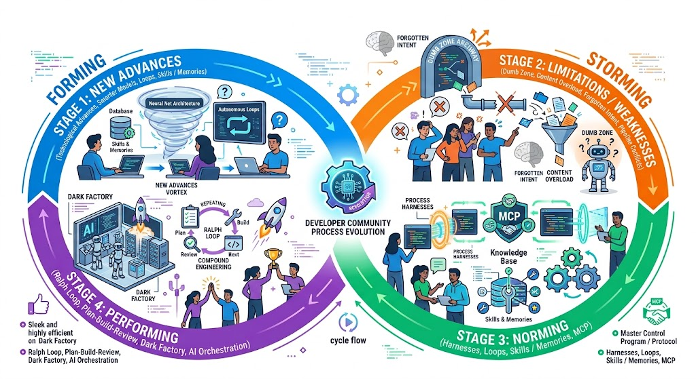
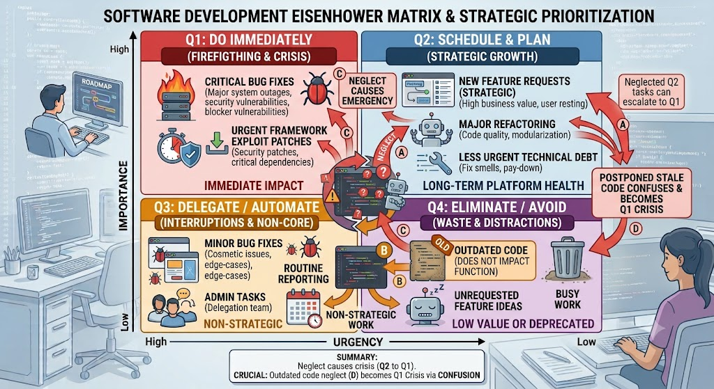

# Don't Just Do More

Without a doubt AI has revolutionised software development and is here to stay. But we're constantly adapting to the change, and I'm reminded of the [Tuckman model](https://en.wikipedia.org/wiki/Tuckman%27s_stages_of_group_development). However, it's worth also remembering where the pain points of the past have been beyond just writing code.

<!-- more -->

## The Tuckman Model

I was first introduced to the Tuckman model during a management course shortly after I started in IT. It covers the four stages of team development - **forming**, **storming**, **norming**, and **performing**. But it's relevant to many evolutionary processes.

Over the last few years we've had constant technological advances in the realm of AI, with new models, coding harnesses, and process enhancements. Each evolution has solved pain points, but identified new ones.

- Models got longer context windows, and we found the dumb zone.
- Ralph loops were adopted to solve the problem, but ate up more tokens.
- MCP added more tools, but bloated the context window before we started.
- Harnesses gave a multitude of skills, but some models can fail of basic tool use like updating some files.
- Skills proliferated, but smarter models may no longer part or even all of a skill.
- Agent-in-the-loop for planning has become standard, but that increases token use.
- We got gubagents and unattended agentic use, but token usage went through the roof.
- Newer models got smarter but more expensive, pushing developers to consider multi-model routing.
- AI generated lost of documentation, and we got [content overload](./2026-07-06-ai-intent.md).
- Local AI becomes more powerful, and exacerbates an already-evident problem of hardware availability and supply-chain issues.

### Dark Factories

More recently, we've seen the rise of "dark factory", where AI writes code and no human reads or reviews the code. I've read articles published in the last week by [Dex Horthy](https://github.com/humanlayer/advanced-context-engineering-for-coding-agents/blob/main/wsff.md) and [Addy Osmani](https://addyosmani.com/blog/software-factories/) highlighting the problems that this generates.

The move from [vibe coding](https://x.com/karpathy/status/1886192184808149383?lang=en) to [agentic engineering](https://x.com/karpathy/status/2019137879310836075?lang=en) has helped improve the quality of AI code. But we're still not there yet. And I can fully appreciate the gnawing frustration that arises when you finally encounter an issue so nebulous that there is no option but to read through the code and debug it manually.

Because the bottom line is that whoever you are and however powerful the model you used, the code won't conform to what you consider best practice. Maybe you write or update a skill that tells the model what you or your team prefer. But is that guaranteed to work.

And it's not just about code quality, it's about [understanding and maintaining intent](./2026-07-06-ai-intent.md). The senior developer is constantly thinking of impacts and all potential use cases. A GitHub or JIRA issue needs curating to ensure it effectively translates what all users need, not what one user wants. I've not used the dark factory approach, so I'm not sure how much of this pre-screening is done in reality, but that aspect of more planning up front was something Dex Horthy covered in his post.

### The Drive to Do More

Each new advance allows us to do things we couldn't before. But equally that identifies problems we didn't have before. The community find workarounds and get productive. Harness providers or model providers move what's good higher up the chain. And we need to evolve again.

All the time, we're pushing to deliver more, faster, better. The focus is on how many features are released, how many bugs are squashed, how many issues are closed. Because that's the obvious measurement for ROI.

But sometimes it's more important to step back and focus on what's **important**.

## The Eisenhower Matrix

The [Eisenhower matrix](https://en.wikipedia.org/wiki/Priority_Matrix) is a well-known task management approach that positions tasks in a matrix of urgency and importance. Critical bugs are dealt with immediately. Features and high-value important work is scheduled. Other work falls down the ladder of importance.

We've all seen scenarios where technical debt accumulated - outdated dependencies, creaking architectures that should really be refactored. Everyone acknowledges they need to be addressed. It's just that new features are more important. Until one day things break or stop working, and suddenly they're both urgent and important.

I've already seen in small projects how documentation gets augmented by agents, and outdated content causes confusion and bad decisions. They're not critical, and the additional work they cause is not prohibitive. It's just annoying.

Or there are problems within an application that have workarounds. Or bugs that have been around for many versions. They don't need resolving now, because users aren't screaming about them.

Or multiple ways of doing something because consolidation meant touching code the developer didn't need to, so didn't want to. They don't need addressing now, because the team are aware when to use which. It's not documented anywhere, but it's not caused a problem. Yet.

An aspect [Dex highlights](https://github.com/humanlayer/advanced-context-engineering-for-coding-agents/blob/main/wsff.md#models-degrade-codebase-quality-over-time) is degrading quality in codebases over time. The code works, but the codebase becomes more and more unmaintainable. If you've been doing AI-First development for a while, there are certainly places in your codebases where this is the case already, unless you've been scrupulously curating every single line of code written.

## Do More Right

The power of AI, in my opinion, is this. Because we can do more, we can do more of the stuff we always put off, because it wasn't urgent and important, and **avoid** it becoming urgent and important.

- We can spend time working with AI to ensure the documentation is current and AI-ready.
- We can invest time in cleaning up a brownfield codebase before we start, so development moves quicker.
- We can regularly remove outdated code or duplication, so future tasks succeed first time.
- We can look at some of that painful refactoring we've put off, before it becomes a major architectural headache.
- We can update dependencies more aggressively, before pressure of end of support.
- We can investigate using AI to use innovative approaches to support newer versions with the latest-and-greatest dependencies while maintaining legacy support.

The ROI for development should not just be how many more features are you delivering and how many fires are you putting out more quickly. It should also be how much more are you doing to prevent future problems. And how ready are you for the future, because of what you did yesterday.
